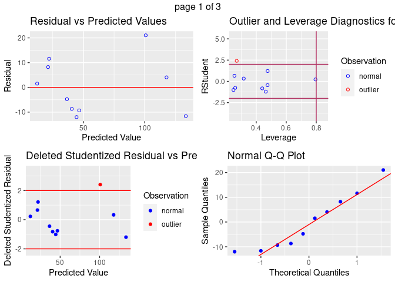
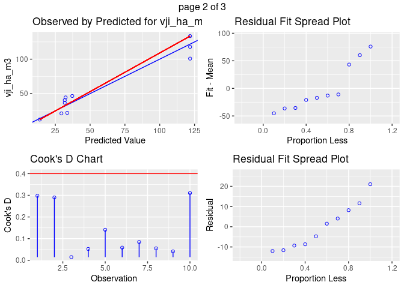
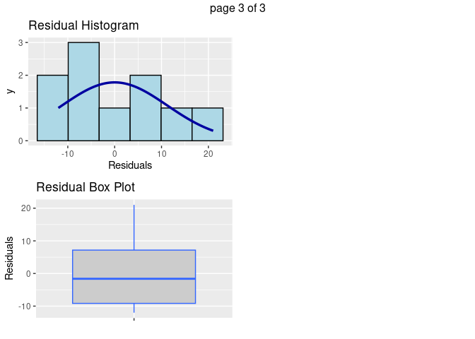
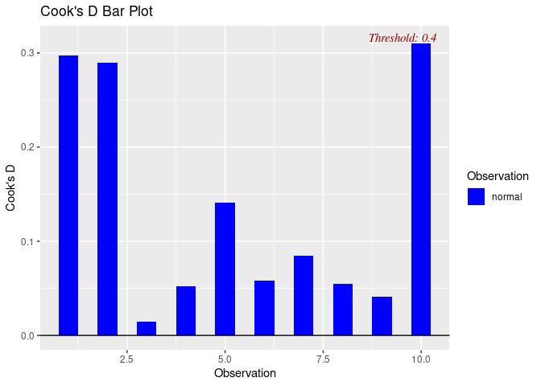
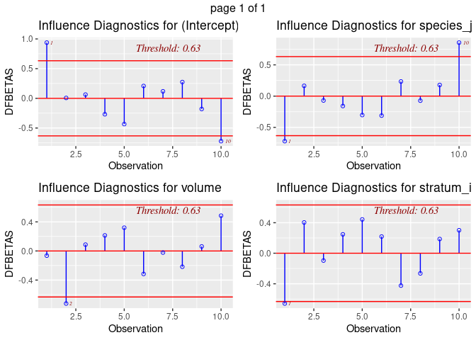
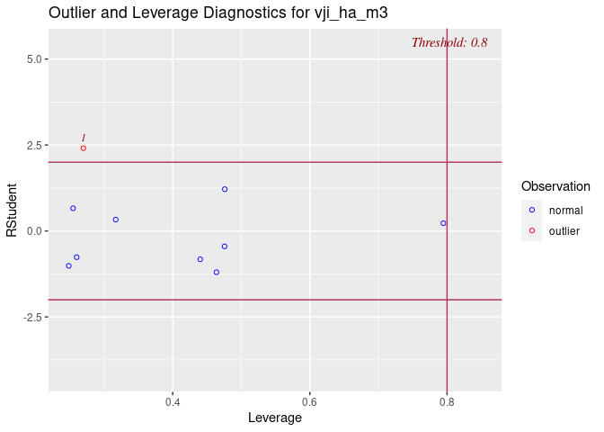
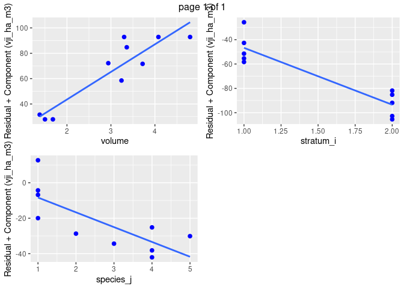
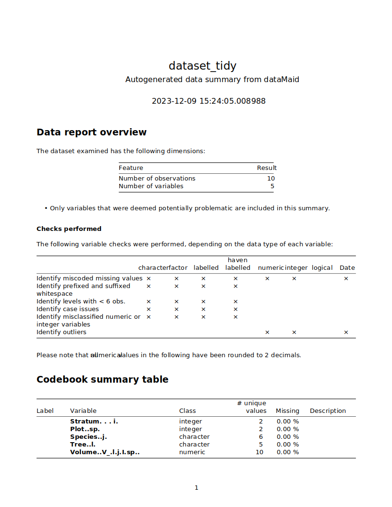

Technical Exercise for Program Officer Candidate; Verra Technology
Solutions
================
SMurphy
2023-12-04

- [Task 1](#task-1)
- [1.1 Import Data](#11-import-data)
- [1.2 Audit Data](#12-audit-data)
- [1.3 Tidy Data](#13-tidy-data)
- [2.1 Compute Biomass at Plot Level
  (Eq1)](#21-compute-biomass-at-plot-level-eq1)
- [2.2 Compute Biomass at Strata Level
  (Eq2)](#22-compute-biomass-at-strata-level-eq2)
- [2.3 Compute Carbon in Harvested Volumes
  (Eq3)](#23-compute-carbon-in-harvested-volumes-eq3)
- [2.4 Compute Carbon in Extracted Volumes
  (Eq4)](#24-compute-carbon-in-extracted-volumes-eq4)
- [3.1 Additional Metrics](#31-additional-metrics)
- [3.2 Regression Diagnostics](#32-regression-diagnostics)
- [Appendix I: Codebook Derived](#appendix1)
- [Task 2](#task-2)

## Task 1

***Prototype Tool for Quantifying GHG in Standing Timber Using
VSC-Methodology-VM0010***

The following workflow was used to test a prototype tool for quantifying
greenhouse gas (GHG) emissions reduction. The objective is to illustrate
the process outlined in the VCS Methodology, specifically VM0010, with
an emphasis on simplicity of tool design over burdensome complexity. The
chosen subsection for digitalization is “8.1.1 Calculation of carbon
stocks in commercial timber volumes”. A condensed script including only
essential functions of this tool is reproduced in [Appendix
I](#appendix1).

A number of empricial assumptions were made including sourcing of
pre-existing inventory dataset with pre-defined format and values
published in the exercise’s document (‘Program Officer Technology
Solutions Seamus Murphy’). Using this table of observations, an excel
spreadsheet was copied into and imported into an R environment as the
dataframe ’`dataset_raw'` and commited to the project’s github
repository
[here](https://github.com/seamusrobertmurphy/verra-stage1-GHG-tool.git).
In this original, unchanged dataset, assumptions of values can be viewed
regarding sample strata, plot, species, tree, volume, species wood
characteristics, and plot area.

The following table presents a data dictionary of these values, along
with descriptions of their units, variable labels, types and file
structure. Documentation of the dataset as it was received in original
format ‘`dataset_raw.xlsx`’ and descriptions of output dataset
’`dataset_tidy.xlsx'` are intended to enable reproducability, encourage
collaboration and inform future procedures for data submissions from
clients.

<table style="width:99%;">
<colgroup>
<col style="width: 19%" />
<col style="width: 14%" />
<col style="width: 43%" />
<col style="width: 11%" />
<col style="width: 9%" />
</colgroup>
<tbody>
<tr class="odd">
<td><h4
id="label-original--transformed"><sub><strong>Label</strong> (original =&gt; transformed)</sub></h4></td>
<td><h4
id="file-location"><sub><strong>File location</strong></sub></h4></td>
<td><h4
id="variable-description"><sub><strong>Variable description</strong></sub></h4></td>
<td><h4
id="units-values"><sub><strong>Units, values</strong></sub></h4></td>
<td><h4 id="type"><sub><strong>Type</strong></sub></h4></td>
</tr>
<tr class="even">
<td><sub>“Volume.V.l.j.I.sp”=&gt; “volume”</sub></td>
<td><sub>‘dataset_raw’, ‘dataset_tidy’</sub></td>
<td><sub>Whole stem volume of living tree</sub></td>
<td><sub>m3</sub></td>
<td><sub>numeric</sub></td>
</tr>
<tr class="odd">
<td><sub>“Species..j.” =&gt; “species_j”</sub></td>
<td><sub>‘dataset_raw’, ‘dataset_tidy’</sub></td>
<td><sub>Tree species used at the species summary level.</sub></td>
<td><sub>Sp1–Sp5</sub></td>
<td><sub>character</sub></td>
</tr>
<tr class="even">
<td><sub>“Stratum...i.” =&gt; ’stratum_i”</sub></td>
<td><sub>‘dataset_raw’, ‘dataset_tidy’</sub></td>
<td><sub>Free form text field identifying stratum of each plot.</sub></td>
<td><sub>1, 2</sub></td>
<td><sub>integer &gt; Factor</sub></td>
</tr>
<tr class="odd">
<td><sub>“Plot..sp.” =&gt; “plot_sp”</sub></td>
<td><sub>‘dataset_raw’, ‘dataset_tidy’</sub></td>
<td><sub>Numerical identifier unique only within its stratum.</sub></td>
<td><sub>1, 2, 3</sub></td>
<td><sub>integer</sub></td>
</tr>
<tr class="even">
<td><sub>“Tree..l.” =&gt; “tree_l”</sub></td>
<td><sub>‘dataset_raw’, ‘dataset_tidy’</sub></td>
<td><sub>Text field identifying tree observation unique only specific plot family of associated stratum.</sub></td>
<td><sub>t1 - t5</sub></td>
<td><sub>character&gt;numeric</sub></td>
</tr>
<tr class="odd">
<td><sub>“bcef_r”</sub></td>
<td><sub>‘dataset_raw’, ‘dataset_tidy’</sub></td>
<td><sub>Biomass conversion and expansion factor used to derive carbon stocks from timber volume</sub></td>
<td><sub>%</sub></td>
<td><sub>numeric</sub></td>
</tr>
<tr class="even">
<td><sub>“cf”</sub></td>
<td><sub>‘dataset_raw’, ‘dataset_tidy’</sub></td>
<td><sub>Carbon factor used to derive carbon stocks from volumes of extracted  timber</sub></td>
<td><sub>%</sub></td>
<td><sub>numeric</sub></td>
</tr>
<tr class="odd">
<td><sub>“d”</sub></td>
<td><sub>‘dataset_tidy’,</sub></td>
<td><sub>Basic wood density represented as fraction of dry in tons to green volume</sub></td>
<td><sub>%</sub></td>
<td><sub>numeric</sub></td>
</tr>
<tr class="even">
<td><sub>“a_sp”</sub></td>
<td><sub>dataset_tidy</sub></td>
<td><sub>Area in hectares of individual sample plots</sub></td>
<td><sub>ha</sub></td>
<td><sub>numeric</sub></td>
</tr>
<tr class="odd">
<td><sub>“vji_sp_m3”</sub></td>
<td><sub>dataset_tidy</sub></td>
<td><sub>Sum volume of merchantable timber of a species from specific plots within specific stratum</sub></td>
<td><sub>m3</sub></td>
<td><sub>numeric</sub></td>
</tr>
<tr class="even">
<td><sub>“vji_ha_m3”</sub></td>
<td><sub>dataset_tidy</sub></td>
<td><sub>Mean volume per hectare of merchantable timber of a species in a specific stratum.</sub></td>
<td><sub>m3.ha-1</sub></td>
<td><sub>numeric</sub></td>
</tr>
<tr class="odd">
<td><sub>chb_ha_tC</sub></td>
<td><sub>dataset_tidy</sub></td>
<td><sub>Mean volume of carbon in extracted timber of species in stratum using ‘bcef_r’ and ‘cf’ factors.</sub></td>
<td><sub>tC.ha-1</sub></td>
<td><sub>numeric</sub></td>
</tr>
<tr class="even">
<td><sub>cex_ha_tC</sub></td>
<td><sub>dataset_tidy</sub></td>
<td><sub>Mean volume of carbon in extracted biomass of a species in a stratum using ‘d’ and ‘cf’ factors.</sub></td>
<td><sub>tC.ha-1</sub></td>
<td><sub>numeric</sub></td>
</tr>
</tbody>
</table>

## 1.1 Import Data

Import `dataset_raw` and write copy to `dataset_tidy`. Seed is set to
`77777`.

``` r
set.seed(77777)
dataset_raw <- read_excel("dataset_raw.xlsx")
write.csv(dataset_raw, "dataset_tidy.csv", row.names = FALSE)
dataset_tidy <- read.csv("dataset_tidy.csv")
dataset_tidy
```

    # A tibble: 10 × 5
       Stratum...i. Plot..sp. Species..j. Tree..l. Volume..V_.l.j.I.sp..
              <int>     <int> <chr>       <chr>                    <dbl>
     1            1         1 Sp1         t1                        3.3 
     2            1         1 Sp1         t2                        4.8 
     3            1         1 Sp1         t3                        4.08
     4            1         2 Sp4         t1                        1.5 
     5            1         2 Sp4         t2                        1.68
     6            2         1 Sp1         t1                        1.38
     7            2         1 Sp2         t2                        3.24
     8            2         1 Sp3         t3                        3.72
     9            2         1 sp4         t4                        2.94
    10            2         1 Sp5         t5                        3.36

## 1.2 Audit Data

Examine structure, scan for errors, and save audit report for input to
codebook ([Appendix I](#appendix1)).

``` r
str(dataset_tidy)
dplyr::count(dataset_tidy, Species..j.)

saveHTML(dataMaid::makeDataReport(
  dataset_tidy,
  output = "html",
  codebook = TRUE,
  onlyProblematic = TRUE,
  visuals = setVisuals(all = "basicVisual"),
  replace = TRUE
))
```

    'data.frame':   10 obs. of  5 variables:
     $ Stratum...i.         : int  1 1 1 1 1 2 2 2 2 2
     $ Plot..sp.            : int  1 1 1 2 2 1 1 1 1 1
     $ Species..j.          : chr  "Sp1" "Sp1" "Sp1" "Sp4" ...
     $ Tree..l.             : chr  "t1" "t2" "t3" "t1" ...
     $ Volume..V_.l.j.I.sp..: num  3.3 4.8 4.08 1.5 1.68 1.38 3.24 3.72 2.94 3.36

    # A tibble: 6 × 2
      Species..j.     n
      <chr>       <int>
    1 Sp1             4
    2 Sp2             1
    3 Sp3             1
    4 Sp4             2
    5 Sp5             1
    6 sp4             1

## 1.3 Tidy Data

Tests identified one problematic entry in values of `Species..j.`
variable and multiple naming issues inherited during data import.
Variable relabelling ws carried out according to naming convention
stated in exercise document, the symbology used in subsection equations
1-4 of 8.1.1 of the [VM0010 Verra
Methodology](https://verra.org/wp-content/uploads/2018/03/VM0010-Methodology-for-IMF-LtPF-v1.3_0.pdf),
and syntax standards provided in the [Tidyverse style
guide](https://style.tidyverse.org/). This involved the following
changes.

- Correct the case-sensitive error from `sp4` to `Sp4`.
- Convert or recode variables to reflec their class
- Remove spaces
- Use underscores between words
- Change to lowercase
- Warnings, messages turned to silent
- Space placed after commas
- Max 80 characters to chunks
- Comments limited to single line each
- `::` operator used to signpost installs & avoid package conflicts

``` r
data.table::setnames(dataset_tidy, old = "Stratum...i.", new = "stratum_i", skip_absent = TRUE)
data.table::setnames(dataset_tidy, old = "Species..j.", new = "species_j", skip_absent = TRUE)
data.table::setnames(dataset_tidy, old = "Plot..sp.", new = "plot_sp", skip_absent = TRUE)
data.table::setnames(dataset_tidy, old = "Tree..l.", new = "tree_l", skip_absent = TRUE)
data.table::setnames(dataset_tidy, old = "Volume..V_.l.j.I.sp..", new = "volume", skip_absent = TRUE)
dataset_tidy$species_j[dataset_tidy$species_j == "sp4"] <- "Sp4"
dataset_tidy$species_j <- as.factor(dataset_tidy$species_j)
dataset_tidy$stratum_i <- as.factor(dataset_tidy$stratum_i)
```

<br>

Derive new variable columns using values provided in the exercise
document. Compute additional variables of area estimates at different
units and scales:

- `bcef_r`: Biomass expansion factor applicable to wood removals (t.d.m
  m<sup>-3</sup>).
- `cf`: Carbon fraction of biomass of species (tCt d.m.<sup>-1</sup>)
- `d`: Basic wood density of species (t d.m. m<sup>-3</sup>)
- `a_sp`: Total area of plot in hectares (ha)
- `a_sp_m2`: Total area of plot in metres squared (m<sup>2</sup>)
- `a_I_m2`: Total area of stratum in metres squared (m<sup>2</sup>)
- `a_I_ha`: Total area of stratum in hectares (ha)

Tabulate, confirm and write to directory.

``` r
dataset_tidy$bcef_r <- 0.7
dataset_tidy$cf <- 0.5
dataset_tidy$d <- 0.5
dataset_tidy$a_sp <- 0.1
dataset_tidy$a_sp_m2 <- dataset_tidy$a_sp * 10000

dataset_tidy <- dataset_tidy %>%
  group_by(stratum_i) %>%
  mutate(a_I_m2 = sum(a_sp_m2), a_I_ha = sum(a_sp))

dataset_tidy %>%
  select(stratum_i, species_j, plot_sp, tree_l, volume) %>%
  gtsummary::tbl_summary(
    by = species_j,
    statistic = list(
      all_continuous() ~ "{mean} ({sd})",
      all_categorical() ~ "{n} / {N} ({p}%)"
    ),
    digits = all_continuous() ~ 1,
    type = all_categorical() ~ "categorical",
    label = list(
      stratum_i ~ "Strata",
      species_j ~ "Species",
      plot_sp ~ "Plot ID#",
      tree_l ~ "Tree ID#",
      volume ~ "Biomass Volume (m3)"
    ),
    missing_text = "Missing"
  )
```

<!--html_preserve-->

<div id="amxsvjjufh"
style="padding-left:0px;padding-right:0px;padding-top:10px;padding-bottom:10px;overflow-x:auto;overflow-y:auto;width:auto;height:auto;">

<style>#amxsvjjufh table {
  font-family: system-ui, 'Segoe UI', Roboto, Helvetica, Arial, sans-serif, 'Apple Color Emoji', 'Segoe UI Emoji', 'Segoe UI Symbol', 'Noto Color Emoji';
  -webkit-font-smoothing: antialiased;
  -moz-osx-font-smoothing: grayscale;
}
&#10;#amxsvjjufh thead, #amxsvjjufh tbody, #amxsvjjufh tfoot, #amxsvjjufh tr, #amxsvjjufh td, #amxsvjjufh th {
  border-style: none;
}
&#10;#amxsvjjufh p {
  margin: 0;
  padding: 0;
}
&#10;#amxsvjjufh .gt_table {
  display: table;
  border-collapse: collapse;
  line-height: normal;
  margin-left: auto;
  margin-right: auto;
  color: #333333;
  font-size: 16px;
  font-weight: normal;
  font-style: normal;
  background-color: #FFFFFF;
  width: auto;
  border-top-style: solid;
  border-top-width: 2px;
  border-top-color: #A8A8A8;
  border-right-style: none;
  border-right-width: 2px;
  border-right-color: #D3D3D3;
  border-bottom-style: solid;
  border-bottom-width: 2px;
  border-bottom-color: #A8A8A8;
  border-left-style: none;
  border-left-width: 2px;
  border-left-color: #D3D3D3;
}
&#10;#amxsvjjufh .gt_caption {
  padding-top: 4px;
  padding-bottom: 4px;
}
&#10;#amxsvjjufh .gt_title {
  color: #333333;
  font-size: 125%;
  font-weight: initial;
  padding-top: 4px;
  padding-bottom: 4px;
  padding-left: 5px;
  padding-right: 5px;
  border-bottom-color: #FFFFFF;
  border-bottom-width: 0;
}
&#10;#amxsvjjufh .gt_subtitle {
  color: #333333;
  font-size: 85%;
  font-weight: initial;
  padding-top: 3px;
  padding-bottom: 5px;
  padding-left: 5px;
  padding-right: 5px;
  border-top-color: #FFFFFF;
  border-top-width: 0;
}
&#10;#amxsvjjufh .gt_heading {
  background-color: #FFFFFF;
  text-align: center;
  border-bottom-color: #FFFFFF;
  border-left-style: none;
  border-left-width: 1px;
  border-left-color: #D3D3D3;
  border-right-style: none;
  border-right-width: 1px;
  border-right-color: #D3D3D3;
}
&#10;#amxsvjjufh .gt_bottom_border {
  border-bottom-style: solid;
  border-bottom-width: 2px;
  border-bottom-color: #D3D3D3;
}
&#10;#amxsvjjufh .gt_col_headings {
  border-top-style: solid;
  border-top-width: 2px;
  border-top-color: #D3D3D3;
  border-bottom-style: solid;
  border-bottom-width: 2px;
  border-bottom-color: #D3D3D3;
  border-left-style: none;
  border-left-width: 1px;
  border-left-color: #D3D3D3;
  border-right-style: none;
  border-right-width: 1px;
  border-right-color: #D3D3D3;
}
&#10;#amxsvjjufh .gt_col_heading {
  color: #333333;
  background-color: #FFFFFF;
  font-size: 100%;
  font-weight: normal;
  text-transform: inherit;
  border-left-style: none;
  border-left-width: 1px;
  border-left-color: #D3D3D3;
  border-right-style: none;
  border-right-width: 1px;
  border-right-color: #D3D3D3;
  vertical-align: bottom;
  padding-top: 5px;
  padding-bottom: 6px;
  padding-left: 5px;
  padding-right: 5px;
  overflow-x: hidden;
}
&#10;#amxsvjjufh .gt_column_spanner_outer {
  color: #333333;
  background-color: #FFFFFF;
  font-size: 100%;
  font-weight: normal;
  text-transform: inherit;
  padding-top: 0;
  padding-bottom: 0;
  padding-left: 4px;
  padding-right: 4px;
}
&#10;#amxsvjjufh .gt_column_spanner_outer:first-child {
  padding-left: 0;
}
&#10;#amxsvjjufh .gt_column_spanner_outer:last-child {
  padding-right: 0;
}
&#10;#amxsvjjufh .gt_column_spanner {
  border-bottom-style: solid;
  border-bottom-width: 2px;
  border-bottom-color: #D3D3D3;
  vertical-align: bottom;
  padding-top: 5px;
  padding-bottom: 5px;
  overflow-x: hidden;
  display: inline-block;
  width: 100%;
}
&#10;#amxsvjjufh .gt_spanner_row {
  border-bottom-style: hidden;
}
&#10;#amxsvjjufh .gt_group_heading {
  padding-top: 8px;
  padding-bottom: 8px;
  padding-left: 5px;
  padding-right: 5px;
  color: #333333;
  background-color: #FFFFFF;
  font-size: 100%;
  font-weight: initial;
  text-transform: inherit;
  border-top-style: solid;
  border-top-width: 2px;
  border-top-color: #D3D3D3;
  border-bottom-style: solid;
  border-bottom-width: 2px;
  border-bottom-color: #D3D3D3;
  border-left-style: none;
  border-left-width: 1px;
  border-left-color: #D3D3D3;
  border-right-style: none;
  border-right-width: 1px;
  border-right-color: #D3D3D3;
  vertical-align: middle;
  text-align: left;
}
&#10;#amxsvjjufh .gt_empty_group_heading {
  padding: 0.5px;
  color: #333333;
  background-color: #FFFFFF;
  font-size: 100%;
  font-weight: initial;
  border-top-style: solid;
  border-top-width: 2px;
  border-top-color: #D3D3D3;
  border-bottom-style: solid;
  border-bottom-width: 2px;
  border-bottom-color: #D3D3D3;
  vertical-align: middle;
}
&#10;#amxsvjjufh .gt_from_md > :first-child {
  margin-top: 0;
}
&#10;#amxsvjjufh .gt_from_md > :last-child {
  margin-bottom: 0;
}
&#10;#amxsvjjufh .gt_row {
  padding-top: 8px;
  padding-bottom: 8px;
  padding-left: 5px;
  padding-right: 5px;
  margin: 10px;
  border-top-style: solid;
  border-top-width: 1px;
  border-top-color: #D3D3D3;
  border-left-style: none;
  border-left-width: 1px;
  border-left-color: #D3D3D3;
  border-right-style: none;
  border-right-width: 1px;
  border-right-color: #D3D3D3;
  vertical-align: middle;
  overflow-x: hidden;
}
&#10;#amxsvjjufh .gt_stub {
  color: #333333;
  background-color: #FFFFFF;
  font-size: 100%;
  font-weight: initial;
  text-transform: inherit;
  border-right-style: solid;
  border-right-width: 2px;
  border-right-color: #D3D3D3;
  padding-left: 5px;
  padding-right: 5px;
}
&#10;#amxsvjjufh .gt_stub_row_group {
  color: #333333;
  background-color: #FFFFFF;
  font-size: 100%;
  font-weight: initial;
  text-transform: inherit;
  border-right-style: solid;
  border-right-width: 2px;
  border-right-color: #D3D3D3;
  padding-left: 5px;
  padding-right: 5px;
  vertical-align: top;
}
&#10;#amxsvjjufh .gt_row_group_first td {
  border-top-width: 2px;
}
&#10;#amxsvjjufh .gt_row_group_first th {
  border-top-width: 2px;
}
&#10;#amxsvjjufh .gt_summary_row {
  color: #333333;
  background-color: #FFFFFF;
  text-transform: inherit;
  padding-top: 8px;
  padding-bottom: 8px;
  padding-left: 5px;
  padding-right: 5px;
}
&#10;#amxsvjjufh .gt_first_summary_row {
  border-top-style: solid;
  border-top-color: #D3D3D3;
}
&#10;#amxsvjjufh .gt_first_summary_row.thick {
  border-top-width: 2px;
}
&#10;#amxsvjjufh .gt_last_summary_row {
  padding-top: 8px;
  padding-bottom: 8px;
  padding-left: 5px;
  padding-right: 5px;
  border-bottom-style: solid;
  border-bottom-width: 2px;
  border-bottom-color: #D3D3D3;
}
&#10;#amxsvjjufh .gt_grand_summary_row {
  color: #333333;
  background-color: #FFFFFF;
  text-transform: inherit;
  padding-top: 8px;
  padding-bottom: 8px;
  padding-left: 5px;
  padding-right: 5px;
}
&#10;#amxsvjjufh .gt_first_grand_summary_row {
  padding-top: 8px;
  padding-bottom: 8px;
  padding-left: 5px;
  padding-right: 5px;
  border-top-style: double;
  border-top-width: 6px;
  border-top-color: #D3D3D3;
}
&#10;#amxsvjjufh .gt_last_grand_summary_row_top {
  padding-top: 8px;
  padding-bottom: 8px;
  padding-left: 5px;
  padding-right: 5px;
  border-bottom-style: double;
  border-bottom-width: 6px;
  border-bottom-color: #D3D3D3;
}
&#10;#amxsvjjufh .gt_striped {
  background-color: rgba(128, 128, 128, 0.05);
}
&#10;#amxsvjjufh .gt_table_body {
  border-top-style: solid;
  border-top-width: 2px;
  border-top-color: #D3D3D3;
  border-bottom-style: solid;
  border-bottom-width: 2px;
  border-bottom-color: #D3D3D3;
}
&#10;#amxsvjjufh .gt_footnotes {
  color: #333333;
  background-color: #FFFFFF;
  border-bottom-style: none;
  border-bottom-width: 2px;
  border-bottom-color: #D3D3D3;
  border-left-style: none;
  border-left-width: 2px;
  border-left-color: #D3D3D3;
  border-right-style: none;
  border-right-width: 2px;
  border-right-color: #D3D3D3;
}
&#10;#amxsvjjufh .gt_footnote {
  margin: 0px;
  font-size: 90%;
  padding-top: 4px;
  padding-bottom: 4px;
  padding-left: 5px;
  padding-right: 5px;
}
&#10;#amxsvjjufh .gt_sourcenotes {
  color: #333333;
  background-color: #FFFFFF;
  border-bottom-style: none;
  border-bottom-width: 2px;
  border-bottom-color: #D3D3D3;
  border-left-style: none;
  border-left-width: 2px;
  border-left-color: #D3D3D3;
  border-right-style: none;
  border-right-width: 2px;
  border-right-color: #D3D3D3;
}
&#10;#amxsvjjufh .gt_sourcenote {
  font-size: 90%;
  padding-top: 4px;
  padding-bottom: 4px;
  padding-left: 5px;
  padding-right: 5px;
}
&#10;#amxsvjjufh .gt_left {
  text-align: left;
}
&#10;#amxsvjjufh .gt_center {
  text-align: center;
}
&#10;#amxsvjjufh .gt_right {
  text-align: right;
  font-variant-numeric: tabular-nums;
}
&#10;#amxsvjjufh .gt_font_normal {
  font-weight: normal;
}
&#10;#amxsvjjufh .gt_font_bold {
  font-weight: bold;
}
&#10;#amxsvjjufh .gt_font_italic {
  font-style: italic;
}
&#10;#amxsvjjufh .gt_super {
  font-size: 65%;
}
&#10;#amxsvjjufh .gt_footnote_marks {
  font-size: 75%;
  vertical-align: 0.4em;
  position: initial;
}
&#10;#amxsvjjufh .gt_asterisk {
  font-size: 100%;
  vertical-align: 0;
}
&#10;#amxsvjjufh .gt_indent_1 {
  text-indent: 5px;
}
&#10;#amxsvjjufh .gt_indent_2 {
  text-indent: 10px;
}
&#10;#amxsvjjufh .gt_indent_3 {
  text-indent: 15px;
}
&#10;#amxsvjjufh .gt_indent_4 {
  text-indent: 20px;
}
&#10;#amxsvjjufh .gt_indent_5 {
  text-indent: 25px;
}
</style>
<table class="gt_table" data-quarto-disable-processing="false" data-quarto-bootstrap="false">
<thead>
<tr class="gt_col_headings">
<th class="gt_col_heading gt_columns_bottom_border gt_left" rowspan="1" colspan="1" scope="col" id="&lt;strong&gt;Characteristic&lt;/strong&gt;">
<strong>Characteristic</strong>
</th>
<th class="gt_col_heading gt_columns_bottom_border gt_center" rowspan="1" colspan="1" scope="col" id="&lt;strong&gt;Sp1&lt;/strong&gt;, N = 4&lt;span class=&quot;gt_footnote_marks&quot; style=&quot;white-space:nowrap;font-style:italic;font-weight:normal;&quot;&gt;&lt;sup&gt;1&lt;/sup&gt;&lt;/span&gt;">
<strong>Sp1</strong>, N = 4<span class="gt_footnote_marks"
style="white-space:nowrap;font-style:italic;font-weight:normal;"><sup>1</sup></span>
</th>
<th class="gt_col_heading gt_columns_bottom_border gt_center" rowspan="1" colspan="1" scope="col" id="&lt;strong&gt;Sp2&lt;/strong&gt;, N = 1&lt;span class=&quot;gt_footnote_marks&quot; style=&quot;white-space:nowrap;font-style:italic;font-weight:normal;&quot;&gt;&lt;sup&gt;1&lt;/sup&gt;&lt;/span&gt;">
<strong>Sp2</strong>, N = 1<span class="gt_footnote_marks"
style="white-space:nowrap;font-style:italic;font-weight:normal;"><sup>1</sup></span>
</th>
<th class="gt_col_heading gt_columns_bottom_border gt_center" rowspan="1" colspan="1" scope="col" id="&lt;strong&gt;Sp3&lt;/strong&gt;, N = 1&lt;span class=&quot;gt_footnote_marks&quot; style=&quot;white-space:nowrap;font-style:italic;font-weight:normal;&quot;&gt;&lt;sup&gt;1&lt;/sup&gt;&lt;/span&gt;">
<strong>Sp3</strong>, N = 1<span class="gt_footnote_marks"
style="white-space:nowrap;font-style:italic;font-weight:normal;"><sup>1</sup></span>
</th>
<th class="gt_col_heading gt_columns_bottom_border gt_center" rowspan="1" colspan="1" scope="col" id="&lt;strong&gt;Sp4&lt;/strong&gt;, N = 3&lt;span class=&quot;gt_footnote_marks&quot; style=&quot;white-space:nowrap;font-style:italic;font-weight:normal;&quot;&gt;&lt;sup&gt;1&lt;/sup&gt;&lt;/span&gt;">
<strong>Sp4</strong>, N = 3<span class="gt_footnote_marks"
style="white-space:nowrap;font-style:italic;font-weight:normal;"><sup>1</sup></span>
</th>
<th class="gt_col_heading gt_columns_bottom_border gt_center" rowspan="1" colspan="1" scope="col" id="&lt;strong&gt;Sp5&lt;/strong&gt;, N = 1&lt;span class=&quot;gt_footnote_marks&quot; style=&quot;white-space:nowrap;font-style:italic;font-weight:normal;&quot;&gt;&lt;sup&gt;1&lt;/sup&gt;&lt;/span&gt;">
<strong>Sp5</strong>, N = 1<span class="gt_footnote_marks"
style="white-space:nowrap;font-style:italic;font-weight:normal;"><sup>1</sup></span>
</th>
</tr>
</thead>
<tbody class="gt_table_body">
<tr>
<td headers="label" class="gt_row gt_left">
Strata
</td>
<td headers="stat_1" class="gt_row gt_center">
<br />
</td>
<td headers="stat_2" class="gt_row gt_center">
<br />
</td>
<td headers="stat_3" class="gt_row gt_center">
<br />
</td>
<td headers="stat_4" class="gt_row gt_center">
<br />
</td>
<td headers="stat_5" class="gt_row gt_center">
<br />
</td>
</tr>
<tr>
<td headers="label" class="gt_row gt_left">
    1
</td>
<td headers="stat_1" class="gt_row gt_center">
3 / 4 (75%)
</td>
<td headers="stat_2" class="gt_row gt_center">
0 / 1 (0%)
</td>
<td headers="stat_3" class="gt_row gt_center">
0 / 1 (0%)
</td>
<td headers="stat_4" class="gt_row gt_center">
2 / 3 (67%)
</td>
<td headers="stat_5" class="gt_row gt_center">
0 / 1 (0%)
</td>
</tr>
<tr>
<td headers="label" class="gt_row gt_left">
    2
</td>
<td headers="stat_1" class="gt_row gt_center">
1 / 4 (25%)
</td>
<td headers="stat_2" class="gt_row gt_center">
1 / 1 (100%)
</td>
<td headers="stat_3" class="gt_row gt_center">
1 / 1 (100%)
</td>
<td headers="stat_4" class="gt_row gt_center">
1 / 3 (33%)
</td>
<td headers="stat_5" class="gt_row gt_center">
1 / 1 (100%)
</td>
</tr>
<tr>
<td headers="label" class="gt_row gt_left">
Plot ID#
</td>
<td headers="stat_1" class="gt_row gt_center">
<br />
</td>
<td headers="stat_2" class="gt_row gt_center">
<br />
</td>
<td headers="stat_3" class="gt_row gt_center">
<br />
</td>
<td headers="stat_4" class="gt_row gt_center">
<br />
</td>
<td headers="stat_5" class="gt_row gt_center">
<br />
</td>
</tr>
<tr>
<td headers="label" class="gt_row gt_left">
    1
</td>
<td headers="stat_1" class="gt_row gt_center">
4 / 4 (100%)
</td>
<td headers="stat_2" class="gt_row gt_center">
1 / 1 (100%)
</td>
<td headers="stat_3" class="gt_row gt_center">
1 / 1 (100%)
</td>
<td headers="stat_4" class="gt_row gt_center">
1 / 3 (33%)
</td>
<td headers="stat_5" class="gt_row gt_center">
1 / 1 (100%)
</td>
</tr>
<tr>
<td headers="label" class="gt_row gt_left">
    2
</td>
<td headers="stat_1" class="gt_row gt_center">
0 / 4 (0%)
</td>
<td headers="stat_2" class="gt_row gt_center">
0 / 1 (0%)
</td>
<td headers="stat_3" class="gt_row gt_center">
0 / 1 (0%)
</td>
<td headers="stat_4" class="gt_row gt_center">
2 / 3 (67%)
</td>
<td headers="stat_5" class="gt_row gt_center">
0 / 1 (0%)
</td>
</tr>
<tr>
<td headers="label" class="gt_row gt_left">
Tree ID#
</td>
<td headers="stat_1" class="gt_row gt_center">
<br />
</td>
<td headers="stat_2" class="gt_row gt_center">
<br />
</td>
<td headers="stat_3" class="gt_row gt_center">
<br />
</td>
<td headers="stat_4" class="gt_row gt_center">
<br />
</td>
<td headers="stat_5" class="gt_row gt_center">
<br />
</td>
</tr>
<tr>
<td headers="label" class="gt_row gt_left">
    t1
</td>
<td headers="stat_1" class="gt_row gt_center">
2 / 4 (50%)
</td>
<td headers="stat_2" class="gt_row gt_center">
0 / 1 (0%)
</td>
<td headers="stat_3" class="gt_row gt_center">
0 / 1 (0%)
</td>
<td headers="stat_4" class="gt_row gt_center">
1 / 3 (33%)
</td>
<td headers="stat_5" class="gt_row gt_center">
0 / 1 (0%)
</td>
</tr>
<tr>
<td headers="label" class="gt_row gt_left">
    t2
</td>
<td headers="stat_1" class="gt_row gt_center">
1 / 4 (25%)
</td>
<td headers="stat_2" class="gt_row gt_center">
1 / 1 (100%)
</td>
<td headers="stat_3" class="gt_row gt_center">
0 / 1 (0%)
</td>
<td headers="stat_4" class="gt_row gt_center">
1 / 3 (33%)
</td>
<td headers="stat_5" class="gt_row gt_center">
0 / 1 (0%)
</td>
</tr>
<tr>
<td headers="label" class="gt_row gt_left">
    t3
</td>
<td headers="stat_1" class="gt_row gt_center">
1 / 4 (25%)
</td>
<td headers="stat_2" class="gt_row gt_center">
0 / 1 (0%)
</td>
<td headers="stat_3" class="gt_row gt_center">
1 / 1 (100%)
</td>
<td headers="stat_4" class="gt_row gt_center">
0 / 3 (0%)
</td>
<td headers="stat_5" class="gt_row gt_center">
0 / 1 (0%)
</td>
</tr>
<tr>
<td headers="label" class="gt_row gt_left">
    t4
</td>
<td headers="stat_1" class="gt_row gt_center">
0 / 4 (0%)
</td>
<td headers="stat_2" class="gt_row gt_center">
0 / 1 (0%)
</td>
<td headers="stat_3" class="gt_row gt_center">
0 / 1 (0%)
</td>
<td headers="stat_4" class="gt_row gt_center">
1 / 3 (33%)
</td>
<td headers="stat_5" class="gt_row gt_center">
0 / 1 (0%)
</td>
</tr>
<tr>
<td headers="label" class="gt_row gt_left">
    t5
</td>
<td headers="stat_1" class="gt_row gt_center">
0 / 4 (0%)
</td>
<td headers="stat_2" class="gt_row gt_center">
0 / 1 (0%)
</td>
<td headers="stat_3" class="gt_row gt_center">
0 / 1 (0%)
</td>
<td headers="stat_4" class="gt_row gt_center">
0 / 3 (0%)
</td>
<td headers="stat_5" class="gt_row gt_center">
1 / 1 (100%)
</td>
</tr>
<tr>
<td headers="label" class="gt_row gt_left">
Biomass Volume (m3)
</td>
<td headers="stat_1" class="gt_row gt_center">
3.4 (1.5)
</td>
<td headers="stat_2" class="gt_row gt_center">
3.2 (NA)
</td>
<td headers="stat_3" class="gt_row gt_center">
3.7 (NA)
</td>
<td headers="stat_4" class="gt_row gt_center">
2.0 (0.8)
</td>
<td headers="stat_5" class="gt_row gt_center">
3.4 (NA)
</td>
</tr>
</tbody>
<tfoot class="gt_footnotes">
<tr>
<td class="gt_footnote" colspan="6">
<span class="gt_footnote_marks"
style="white-space:nowrap;font-style:italic;font-weight:normal;"><sup>1</sup></span>
n / N (%); Mean (SD)
</td>
</tr>
</tfoot>
</table>

</div>

<!--/html_preserve-->

``` r
write.csv(dataset_tidy, "dataset_tidy.csv", row.names = FALSE)
```

<br>

## 2.1 Compute Biomass at Plot Level (Eq1)

Note all four equations that follow derive estimates according to
specific species, whether measured at the plot level, stratum or
globally. Hence, caution is advised when computing initial, absolute
estimates and when deriving or applying hectare expansion factors.

On page 19 of the VM0010 Methodology, ‘equation 1’ provides calculation
of merchantable timber volume of a species at the plot level. This is
estimated in m<sup>3</sup> as follows:

<br>

                                                     $V_{j,i|BSL} = \sum_{l = 1}^{L} V_{l,j,i,sp}$

<br>

where $V_{j,i|BSL}$ refers to the <u>***sum***</u> of merchantable
volume of species *j* from plot *sp* in stratum *i.* For this, we run
the following:

``` r
dataset_tidy <- dataset_tidy %>%
  group_by(species_j, stratum_i, plot_sp) %>%
  mutate(vji_sp_m3 = sum(volume))

data.table::setDT(dataset_tidy)[, .(
  vji_sp_m3 = sum(volume)
),
by = .(stratum_i, plot_sp, species_j)
]
```

    # A tibble: 7 × 4
      stratum_i plot_sp species_j vji_sp_m3
      <fct>       <int> <fct>         <dbl>
    1 1               1 Sp1           12.2 
    2 1               2 Sp4            3.18
    3 2               1 Sp1            1.38
    4 2               1 Sp2            3.24
    5 2               1 Sp3            3.72
    6 2               1 Sp4            2.94
    7 2               1 Sp5            3.36

<br>

## 2.2 Compute Biomass at Strata Level (Eq2)

On page 19 of the VM0010 Methodology, ‘equation 2’ provides calculation
of merchantable timber volume of a species at the stratum level:

<br>

                                                 $V_{j,i|BSL} = \displaystyle \frac{1}{SP} \sum_{sp=1}^{sp} \displaystyle \frac{V_{j,i,sp}}{A_{sp}}$

<br>

where $V_{j,i|BSL}$ refers to the <u>***mean***</u> merchantable timber
volume of species *j* measured across all plots within stratum *i*.
Volume estimates are derived in terms of m<sup>3</sup>/ha<sup>-1</sup>
using an expansion factor derived as the ratio of plot area
1,000m<sup>2</sup> to 10,000m<sup>2</sup>, as follows.

``` r
dataset_tidy <- dataset_tidy %>%
  group_by(stratum_i, species_j) %>%
  mutate(vji_ha_m3 = mean(vji_sp_m3) * 10)

data.table::setDT(dataset_tidy)[, .(
  vji_sp_m3,
  vji_ha_m3 = mean(vji_sp_m3) * 10
),
by = .(stratum_i, species_j)
]
```

    # A tibble: 10 × 4
       stratum_i species_j vji_sp_m3 vji_ha_m3
       <fct>     <fct>         <dbl>     <dbl>
     1 1         Sp1           12.2      122. 
     2 1         Sp1           12.2      122. 
     3 1         Sp1           12.2      122. 
     4 1         Sp4            3.18      31.8
     5 1         Sp4            3.18      31.8
     6 2         Sp1            1.38      13.8
     7 2         Sp2            3.24      32.4
     8 2         Sp3            3.72      37.2
     9 2         Sp4            2.94      29.4
    10 2         Sp5            3.36      33.6

<br>

## 2.3 Compute Carbon in Harvested Volumes (Eq3)

On page 20 of the VM0010 Methodology, ‘equation 3’ provides calculation
of carbon stock of harvested timber volumes for species *i* in stratum
*i*.

In the absence of harvest plan data, carbon stocks of commercial timber
will be derived from the full inventory `dataset_tidy`.

This differs to ‘equation 3’ below, which measures mean carbon stock
from volumes of ‘harvested biomass’ $C_{HB,j,i|BSL}$ comprised of
volumes estimates from extracted timber that is destined off-site for
market sales, in addition to volume estimates from extracted timber that
is remaining on-site due to damage or use during site operations and
road construction. The difference in destinations of these carbon stocks
means that alternative carbon factors must be applied in their
calculation, as indicated in following two equations

<br>

                            $C_{HB,j,i|BSL} = (V_{EX,j,i|BSL} + V_{EX,INF,j,i|BSL} ) * BCEF_{R} * CF_{j}$

<br>

Carbon estimates are calculated in units of metric tons per hectare
(tC/ha<sup>-1</sup>) by multiplying mean volume per hectare of extracted
timber of species *i* from stratum *j* by the carbon fraction $CF$ and
biomass conversion and expansion factor $BCEF_{R}$ of that species.

``` r
dataset_tidy <- dataset_tidy %>%
  mutate(chb_ha_tC = vji_ha_m3 * bcef_r * cf)

data.table::setDT(dataset_tidy)[, .(
  vji_sp_m3,
  vji_ha_m3,
  chb_ha_tC = vji_ha_m3 * bcef_r * cf
),
by = .(stratum_i, species_j)
]
```

    # A tibble: 10 × 5
       stratum_i species_j vji_sp_m3 vji_ha_m3 chb_ha_tC
       <fct>     <fct>         <dbl>     <dbl>     <dbl>
     1 1         Sp1           12.2      122.      42.6 
     2 1         Sp1           12.2      122.      42.6 
     3 1         Sp1           12.2      122.      42.6 
     4 1         Sp4            3.18      31.8     11.1 
     5 1         Sp4            3.18      31.8     11.1 
     6 2         Sp1            1.38      13.8      4.83
     7 2         Sp2            3.24      32.4     11.3 
     8 2         Sp3            3.72      37.2     13.0 
     9 2         Sp4            2.94      29.4     10.3 
    10 2         Sp5            3.36      33.6     11.8 

<br>

## 2.4 Compute Carbon in Extracted Volumes (Eq4)

On page 21 of the VM0010 Methodology, ‘equation 4’ provides calculation
of mean estimates of carbon stocks of species *i* in stratum *j,* by
multiplying the species’ value of basic wood density $D$ by its carbon
fraction $CF$ by its mean volume of extracted biomass per hectare.
Estimates of carbon stocks are derived in terms of metric tons per
hectare tC.ha<sup>-1</sup> using the following formula:

<br>

                                  $C_{EX,j,i|BSL} = (V_{EX,j,i|BSL} + V_{EX,INF,j,i|BSL} ) * D_{j} * CF_{j}$

<br>

``` r
dataset_tidy <- dataset_tidy %>%
  mutate(cex_ha_tC = vji_ha_m3 * d * cf)

data.table::setDT(dataset_tidy)[, .(
  vji_sp_m3,
  vji_ha_m3,
  chb_ha_tC,
  cex_ha_tC = vji_ha_m3 * d * cf
),
by = .(stratum_i, species_j)
]
```

    # A tibble: 10 × 6
       stratum_i species_j vji_sp_m3 vji_ha_m3 chb_ha_tC cex_ha_tC
       <fct>     <fct>         <dbl>     <dbl>     <dbl>     <dbl>
     1 1         Sp1           12.2      122.      42.6      30.4 
     2 1         Sp1           12.2      122.      42.6      30.4 
     3 1         Sp1           12.2      122.      42.6      30.4 
     4 1         Sp4            3.18      31.8     11.1       7.95
     5 1         Sp4            3.18      31.8     11.1       7.95
     6 2         Sp1            1.38      13.8      4.83      3.45
     7 2         Sp2            3.24      32.4     11.3       8.1 
     8 2         Sp3            3.72      37.2     13.0       9.3 
     9 2         Sp4            2.94      29.4     10.3       7.35
    10 2         Sp5            3.36      33.6     11.8       8.4 

## 3.1 Additional Metrics

``` r
# vJ_ha_m3: Mean volume by species across strata (m^3.ha-1)
dataset_tidy <- dataset_tidy %>%
  group_by(species_j) %>%
  mutate(vJ_ha_m3 = mean(vji_sp_m3) * 10)
dataset_tidy[1:10, ] %>%
  select(
    stratum_i, species_j,
    plot_sp, vji_ha_m3,
    chb_ha_tC, cex_ha_tC,
    vJ_ha_m3
  ) %>%
  kbl(caption = "Table with right-hand showing mean biomass volume per species across all strata (m3.ha-1)", escape = T) %>%
  kable_minimal(full_width = T)
```

<table class=" lightable-minimal" style="font-family: &quot;Trebuchet MS&quot;, verdana, sans-serif; margin-left: auto; margin-right: auto;">
<caption>
Table with right-hand showing mean biomass volume per species across all
strata (m3.ha-1)
</caption>
<thead>
<tr>
<th style="text-align:left;">
stratum_i
</th>
<th style="text-align:left;">
species_j
</th>
<th style="text-align:right;">
plot_sp
</th>
<th style="text-align:right;">
vji_ha_m3
</th>
<th style="text-align:right;">
chb_ha_tC
</th>
<th style="text-align:right;">
cex_ha_tC
</th>
<th style="text-align:right;">
vJ_ha_m3
</th>
</tr>
</thead>
<tbody>
<tr>
<td style="text-align:left;">
1
</td>
<td style="text-align:left;">
Sp1
</td>
<td style="text-align:right;">
1
</td>
<td style="text-align:right;">
121.8
</td>
<td style="text-align:right;">
42.63
</td>
<td style="text-align:right;">
30.45
</td>
<td style="text-align:right;">
94.8
</td>
</tr>
<tr>
<td style="text-align:left;">
1
</td>
<td style="text-align:left;">
Sp1
</td>
<td style="text-align:right;">
1
</td>
<td style="text-align:right;">
121.8
</td>
<td style="text-align:right;">
42.63
</td>
<td style="text-align:right;">
30.45
</td>
<td style="text-align:right;">
94.8
</td>
</tr>
<tr>
<td style="text-align:left;">
1
</td>
<td style="text-align:left;">
Sp1
</td>
<td style="text-align:right;">
1
</td>
<td style="text-align:right;">
121.8
</td>
<td style="text-align:right;">
42.63
</td>
<td style="text-align:right;">
30.45
</td>
<td style="text-align:right;">
94.8
</td>
</tr>
<tr>
<td style="text-align:left;">
1
</td>
<td style="text-align:left;">
Sp4
</td>
<td style="text-align:right;">
2
</td>
<td style="text-align:right;">
31.8
</td>
<td style="text-align:right;">
11.13
</td>
<td style="text-align:right;">
7.95
</td>
<td style="text-align:right;">
31.0
</td>
</tr>
<tr>
<td style="text-align:left;">
1
</td>
<td style="text-align:left;">
Sp4
</td>
<td style="text-align:right;">
2
</td>
<td style="text-align:right;">
31.8
</td>
<td style="text-align:right;">
11.13
</td>
<td style="text-align:right;">
7.95
</td>
<td style="text-align:right;">
31.0
</td>
</tr>
<tr>
<td style="text-align:left;">
2
</td>
<td style="text-align:left;">
Sp1
</td>
<td style="text-align:right;">
1
</td>
<td style="text-align:right;">
13.8
</td>
<td style="text-align:right;">
4.83
</td>
<td style="text-align:right;">
3.45
</td>
<td style="text-align:right;">
94.8
</td>
</tr>
<tr>
<td style="text-align:left;">
2
</td>
<td style="text-align:left;">
Sp2
</td>
<td style="text-align:right;">
1
</td>
<td style="text-align:right;">
32.4
</td>
<td style="text-align:right;">
11.34
</td>
<td style="text-align:right;">
8.10
</td>
<td style="text-align:right;">
32.4
</td>
</tr>
<tr>
<td style="text-align:left;">
2
</td>
<td style="text-align:left;">
Sp3
</td>
<td style="text-align:right;">
1
</td>
<td style="text-align:right;">
37.2
</td>
<td style="text-align:right;">
13.02
</td>
<td style="text-align:right;">
9.30
</td>
<td style="text-align:right;">
37.2
</td>
</tr>
<tr>
<td style="text-align:left;">
2
</td>
<td style="text-align:left;">
Sp4
</td>
<td style="text-align:right;">
1
</td>
<td style="text-align:right;">
29.4
</td>
<td style="text-align:right;">
10.29
</td>
<td style="text-align:right;">
7.35
</td>
<td style="text-align:right;">
31.0
</td>
</tr>
<tr>
<td style="text-align:left;">
2
</td>
<td style="text-align:left;">
Sp5
</td>
<td style="text-align:right;">
1
</td>
<td style="text-align:right;">
33.6
</td>
<td style="text-align:right;">
11.76
</td>
<td style="text-align:right;">
8.40
</td>
<td style="text-align:right;">
33.6
</td>
</tr>
</tbody>
</table>

``` r
# VI_ha_m3: Mean volume by strata across species and plots (m^3.ha-1)
dataset_tidy <- dataset_tidy %>%
  group_by(stratum_i) %>%
  mutate(vI_ha_m3 = mean(vji_sp_m3) * 10)
dataset_tidy[1:10, ] %>%
  select(
    stratum_i, species_j,
    plot_sp, vji_ha_m3,
    chb_ha_tC, cex_ha_tC,
    vJ_ha_m3, vI_ha_m3
  ) %>%
  kbl(caption = "Table with right-hand column showing mean biomass volume per strata across all species and plots (m3.ha-1)", escape = T) %>%
  kable_minimal(full_width = T)
```

<table class=" lightable-minimal" style="font-family: &quot;Trebuchet MS&quot;, verdana, sans-serif; margin-left: auto; margin-right: auto;">
<caption>
Table with right-hand column showing mean biomass volume per strata
across all species and plots (m3.ha-1)
</caption>
<thead>
<tr>
<th style="text-align:left;">
stratum_i
</th>
<th style="text-align:left;">
species_j
</th>
<th style="text-align:right;">
plot_sp
</th>
<th style="text-align:right;">
vji_ha_m3
</th>
<th style="text-align:right;">
chb_ha_tC
</th>
<th style="text-align:right;">
cex_ha_tC
</th>
<th style="text-align:right;">
vJ_ha_m3
</th>
<th style="text-align:right;">
vI_ha_m3
</th>
</tr>
</thead>
<tbody>
<tr>
<td style="text-align:left;">
1
</td>
<td style="text-align:left;">
Sp1
</td>
<td style="text-align:right;">
1
</td>
<td style="text-align:right;">
121.8
</td>
<td style="text-align:right;">
42.63
</td>
<td style="text-align:right;">
30.45
</td>
<td style="text-align:right;">
94.8
</td>
<td style="text-align:right;">
85.80
</td>
</tr>
<tr>
<td style="text-align:left;">
1
</td>
<td style="text-align:left;">
Sp1
</td>
<td style="text-align:right;">
1
</td>
<td style="text-align:right;">
121.8
</td>
<td style="text-align:right;">
42.63
</td>
<td style="text-align:right;">
30.45
</td>
<td style="text-align:right;">
94.8
</td>
<td style="text-align:right;">
85.80
</td>
</tr>
<tr>
<td style="text-align:left;">
1
</td>
<td style="text-align:left;">
Sp1
</td>
<td style="text-align:right;">
1
</td>
<td style="text-align:right;">
121.8
</td>
<td style="text-align:right;">
42.63
</td>
<td style="text-align:right;">
30.45
</td>
<td style="text-align:right;">
94.8
</td>
<td style="text-align:right;">
85.80
</td>
</tr>
<tr>
<td style="text-align:left;">
1
</td>
<td style="text-align:left;">
Sp4
</td>
<td style="text-align:right;">
2
</td>
<td style="text-align:right;">
31.8
</td>
<td style="text-align:right;">
11.13
</td>
<td style="text-align:right;">
7.95
</td>
<td style="text-align:right;">
31.0
</td>
<td style="text-align:right;">
85.80
</td>
</tr>
<tr>
<td style="text-align:left;">
1
</td>
<td style="text-align:left;">
Sp4
</td>
<td style="text-align:right;">
2
</td>
<td style="text-align:right;">
31.8
</td>
<td style="text-align:right;">
11.13
</td>
<td style="text-align:right;">
7.95
</td>
<td style="text-align:right;">
31.0
</td>
<td style="text-align:right;">
85.80
</td>
</tr>
<tr>
<td style="text-align:left;">
2
</td>
<td style="text-align:left;">
Sp1
</td>
<td style="text-align:right;">
1
</td>
<td style="text-align:right;">
13.8
</td>
<td style="text-align:right;">
4.83
</td>
<td style="text-align:right;">
3.45
</td>
<td style="text-align:right;">
94.8
</td>
<td style="text-align:right;">
29.28
</td>
</tr>
<tr>
<td style="text-align:left;">
2
</td>
<td style="text-align:left;">
Sp2
</td>
<td style="text-align:right;">
1
</td>
<td style="text-align:right;">
32.4
</td>
<td style="text-align:right;">
11.34
</td>
<td style="text-align:right;">
8.10
</td>
<td style="text-align:right;">
32.4
</td>
<td style="text-align:right;">
29.28
</td>
</tr>
<tr>
<td style="text-align:left;">
2
</td>
<td style="text-align:left;">
Sp3
</td>
<td style="text-align:right;">
1
</td>
<td style="text-align:right;">
37.2
</td>
<td style="text-align:right;">
13.02
</td>
<td style="text-align:right;">
9.30
</td>
<td style="text-align:right;">
37.2
</td>
<td style="text-align:right;">
29.28
</td>
</tr>
<tr>
<td style="text-align:left;">
2
</td>
<td style="text-align:left;">
Sp4
</td>
<td style="text-align:right;">
1
</td>
<td style="text-align:right;">
29.4
</td>
<td style="text-align:right;">
10.29
</td>
<td style="text-align:right;">
7.35
</td>
<td style="text-align:right;">
31.0
</td>
<td style="text-align:right;">
29.28
</td>
</tr>
<tr>
<td style="text-align:left;">
2
</td>
<td style="text-align:left;">
Sp5
</td>
<td style="text-align:right;">
1
</td>
<td style="text-align:right;">
33.6
</td>
<td style="text-align:right;">
11.76
</td>
<td style="text-align:right;">
8.40
</td>
<td style="text-align:right;">
33.6
</td>
<td style="text-align:right;">
29.28
</td>
</tr>
</tbody>
</table>

``` r
# Vsp_ha_n3: Total volume per plot (m^3.ha-1)
dataset_tidy <- dataset_tidy %>%
  group_by(plot_sp, stratum_i) %>%
  mutate(Vsp_ha_m3 = sum(volume) * 10)
dataset_tidy[1:10, ] %>%
  select(
    stratum_i,
    plot_sp, vji_ha_m3,
    chb_ha_tC, cex_ha_tC,
    vJ_ha_m3, vI_ha_m3,
    vI_ha_m3, Vsp_ha_m3
  ) %>%
  kbl(caption = "Table with right-hand column showing total biomass per plot across species (m3.ha-1)", escape = T) %>%
  kable_minimal(full_width = T)
```

<table class=" lightable-minimal" style="font-family: &quot;Trebuchet MS&quot;, verdana, sans-serif; margin-left: auto; margin-right: auto;">
<caption>
Table with right-hand column showing total biomass per plot across
species (m3.ha-1)
</caption>
<thead>
<tr>
<th style="text-align:left;">
stratum_i
</th>
<th style="text-align:right;">
plot_sp
</th>
<th style="text-align:right;">
vji_ha_m3
</th>
<th style="text-align:right;">
chb_ha_tC
</th>
<th style="text-align:right;">
cex_ha_tC
</th>
<th style="text-align:right;">
vJ_ha_m3
</th>
<th style="text-align:right;">
vI_ha_m3
</th>
<th style="text-align:right;">
Vsp_ha_m3
</th>
</tr>
</thead>
<tbody>
<tr>
<td style="text-align:left;">
1
</td>
<td style="text-align:right;">
1
</td>
<td style="text-align:right;">
121.8
</td>
<td style="text-align:right;">
42.63
</td>
<td style="text-align:right;">
30.45
</td>
<td style="text-align:right;">
94.8
</td>
<td style="text-align:right;">
85.80
</td>
<td style="text-align:right;">
121.8
</td>
</tr>
<tr>
<td style="text-align:left;">
1
</td>
<td style="text-align:right;">
1
</td>
<td style="text-align:right;">
121.8
</td>
<td style="text-align:right;">
42.63
</td>
<td style="text-align:right;">
30.45
</td>
<td style="text-align:right;">
94.8
</td>
<td style="text-align:right;">
85.80
</td>
<td style="text-align:right;">
121.8
</td>
</tr>
<tr>
<td style="text-align:left;">
1
</td>
<td style="text-align:right;">
1
</td>
<td style="text-align:right;">
121.8
</td>
<td style="text-align:right;">
42.63
</td>
<td style="text-align:right;">
30.45
</td>
<td style="text-align:right;">
94.8
</td>
<td style="text-align:right;">
85.80
</td>
<td style="text-align:right;">
121.8
</td>
</tr>
<tr>
<td style="text-align:left;">
1
</td>
<td style="text-align:right;">
2
</td>
<td style="text-align:right;">
31.8
</td>
<td style="text-align:right;">
11.13
</td>
<td style="text-align:right;">
7.95
</td>
<td style="text-align:right;">
31.0
</td>
<td style="text-align:right;">
85.80
</td>
<td style="text-align:right;">
31.8
</td>
</tr>
<tr>
<td style="text-align:left;">
1
</td>
<td style="text-align:right;">
2
</td>
<td style="text-align:right;">
31.8
</td>
<td style="text-align:right;">
11.13
</td>
<td style="text-align:right;">
7.95
</td>
<td style="text-align:right;">
31.0
</td>
<td style="text-align:right;">
85.80
</td>
<td style="text-align:right;">
31.8
</td>
</tr>
<tr>
<td style="text-align:left;">
2
</td>
<td style="text-align:right;">
1
</td>
<td style="text-align:right;">
13.8
</td>
<td style="text-align:right;">
4.83
</td>
<td style="text-align:right;">
3.45
</td>
<td style="text-align:right;">
94.8
</td>
<td style="text-align:right;">
29.28
</td>
<td style="text-align:right;">
146.4
</td>
</tr>
<tr>
<td style="text-align:left;">
2
</td>
<td style="text-align:right;">
1
</td>
<td style="text-align:right;">
32.4
</td>
<td style="text-align:right;">
11.34
</td>
<td style="text-align:right;">
8.10
</td>
<td style="text-align:right;">
32.4
</td>
<td style="text-align:right;">
29.28
</td>
<td style="text-align:right;">
146.4
</td>
</tr>
<tr>
<td style="text-align:left;">
2
</td>
<td style="text-align:right;">
1
</td>
<td style="text-align:right;">
37.2
</td>
<td style="text-align:right;">
13.02
</td>
<td style="text-align:right;">
9.30
</td>
<td style="text-align:right;">
37.2
</td>
<td style="text-align:right;">
29.28
</td>
<td style="text-align:right;">
146.4
</td>
</tr>
<tr>
<td style="text-align:left;">
2
</td>
<td style="text-align:right;">
1
</td>
<td style="text-align:right;">
29.4
</td>
<td style="text-align:right;">
10.29
</td>
<td style="text-align:right;">
7.35
</td>
<td style="text-align:right;">
31.0
</td>
<td style="text-align:right;">
29.28
</td>
<td style="text-align:right;">
146.4
</td>
</tr>
<tr>
<td style="text-align:left;">
2
</td>
<td style="text-align:right;">
1
</td>
<td style="text-align:right;">
33.6
</td>
<td style="text-align:right;">
11.76
</td>
<td style="text-align:right;">
8.40
</td>
<td style="text-align:right;">
33.6
</td>
<td style="text-align:right;">
29.28
</td>
<td style="text-align:right;">
146.4
</td>
</tr>
</tbody>
</table>

``` r
# Save output dataset
write.csv(dataset_tidy, "dataset_tidy.csv", row.names = FALSE)
```

## 3.2 Regression Diagnostics

<u>*Section unfinished!:*</u> For demonstration purposes only, an
ordinary-least-squared (OLS) model was fitted with unscreened covariates
from the above dataset and deployed to generate predictions of total
standing timber over a site area of 100 hectares. From these
predictions, derived residuals were acquired to showcase a number of
diagnostic tools and accuracy metrics relevant to forest inventory
analyses. This was a specifically diagnostic exercise not suited to
informing or adjusting biomass estimates above. Instead this short
test-run reported on techniques used in cross validation and tuning
functions, encouraging discussion of model comparison and selections by
potential clients.

Variables were recoded as numerics or integers to fit functions below.
Additional set of packages were loaded at this stage as listed in the
`requirements` variable below.

``` r
requirements <- install.packages(
  c(
    "oslrr", "ggplot2", "autoplotly", "BiocManager", "ggbio",
    "car", "psych", "useful", "caret",
    "BIOMASS", "rvest", "lmfor", "DescTools",
    "MLmetrics", "knitr", "phyloseq", "carData"
  ),
  dependencies = TRUE
)
requirements
```

``` r
# str(dataset_tidy)
dataset_tidy$stratum_i <- as.integer(dataset_tidy$stratum_i)
dataset_tidy$species_j <- as.integer(dataset_tidy$species_j)
model_lm1 <- lm(vji_ha_m3 ~ volume + species_j + stratum_i, data = dataset_tidy)
olsrr::ols_regress(vji_ha_m3 ~ volume + species_j + stratum_i, data = dataset_tidy)
```

                             Model Summary                          
    ---------------------------------------------------------------
    R                       0.968       RMSE                13.706 
    R-Squared               0.938       Coef. Var           23.820 
    Adj. R-Squared          0.906       MSE                187.853 
    Pred R-Squared          0.848       MAE                  9.281 
    ---------------------------------------------------------------
     RMSE: Root Mean Square Error 
     MSE: Mean Square Error 
     MAE: Mean Absolute Error 

                                   ANOVA                                 
    --------------------------------------------------------------------
                     Sum of                                             
                    Squares       DF    Mean Square      F         Sig. 
    --------------------------------------------------------------------
    Regression    16909.928        3       5636.643    30.006     5e-04 
    Residual       1127.116        6        187.853                     
    Total         18037.044        9                                    
    --------------------------------------------------------------------

                                        Parameter Estimates                                     
    -------------------------------------------------------------------------------------------
          model       Beta    Std. Error    Std. Beta      t        Sig       lower      upper 
    -------------------------------------------------------------------------------------------
    (Intercept)     84.003        20.840                  4.031    0.007     33.008    134.997 
         volume     21.765         4.239        0.557     5.135    0.002     11.393     32.138 
      species_j     -8.343         3.189       -0.294    -2.616    0.040    -16.145     -0.540 
      stratum_i    -46.712         8.999       -0.550    -5.191    0.002    -68.731    -24.692 
    -------------------------------------------------------------------------------------------

``` r
# psych::describe(dataset_tidy$vji_ha_m3)
# psych::describe(dataset_tidy$volume)
# psych::describe(dataset_tidy$species_j)
# psych::describe(dataset_tidy$stratum_i)

shapiro.test(dataset_tidy$volume)
```


        Shapiro-Wilk normality test

    data:  dataset_tidy$volume
    W = 0.9223, p-value = 0.3766

``` r
shapiro.test(dataset_tidy$vji_ha_m3)
```


        Shapiro-Wilk normality test

    data:  dataset_tidy$vji_ha_m3
    W = 0.69994, p-value = 0.0008795

|              |          |        |        |              |
|--------------|----------|--------|--------|--------------|
| **Variable** | **Mean** | **SD** | **SE** | **Skewness** |
| stratum_i    | 1.5      | 0.53   | 0.17   | 0.00         |
| species_j    | 2.60     | 1.58   | 0.50   | 0.14         |
| volume       | 3.00     | 1.15   | 0.36   | 0.36         |
| vji_ha_m3    | 57.54    | 44.77  | 14.16  | 0.69         |

    -----------------------------------------------
           Test             Statistic       pvalue  
    -----------------------------------------------
    Shapiro-Wilk              0.918          0.3407 
    Kolmogorov-Smirnov        0.1812         0.8419 
    Cramer-von Mises          0.8333         0.0048 
    Anderson-Darling          0.3383         0.4225 
    -----------------------------------------------


     Breusch Pagan Test for Heteroskedasticity
     -----------------------------------------
     Ho: the variance is constant            
     Ha: the variance is not constant        

                    Data                  
     -------------------------------------
     Response : vji_ha_m3 
     Variables: fitted values of vji_ha_m3 

            Test Summary         
     ----------------------------
     DF            =    1 
     Chi2          =    0.7880034 
     Prob > Chi2   =    0.3747045 

    Tolerance and Variance Inflation Factor
    ---------------------------------------
      Variables Tolerance      VIF
    1    volume 0.8842968 1.130842
    2 species_j 0.8247492 1.212490
    3 stratum_i 0.9278966 1.077706


    Eigenvalue and Condition Index
    ------------------------------
      Eigenvalue Condition Index    intercept     volume  species_j    stratum_i
    1 3.63391993        1.000000 3.184201e-03 0.00687952 0.01296957 6.623171e-03
    2 0.25093610        3.805451 4.067109e-03 0.14908146 0.50064841 8.506720e-06
    3 0.08426133        6.567098 2.275283e-05 0.26599152 0.32764056 7.126742e-01
    4 0.03088264       10.847521 9.927259e-01 0.57804751 0.15874147 2.806942e-01

    # A tibble: 1 × 3
      studentized_residual unadjusted_p_val bonferroni_p_val
                     <dbl>            <dbl>            <dbl>
    1                 2.41           0.0609            0.609

    # A tibble: 3 × 3
      Variables Tolerance   VIF
      <chr>         <dbl> <dbl>
    1 volume        0.884  1.13
    2 species_j     0.825  1.21
    3 stratum_i     0.928  1.08



|     |       |       |       |       |       |               |
|-----|-------|-------|-------|-------|-------|---------------|
|     |       | Model | SW    | BP    | BF    | species_j_VIF |
| M1  | 0.918 | 0.375 | 0.609 | 1.078 | 1.212 | 1.131         |
| M2  |       |       |       |       |       |               |
| M3  |       |       |       |       |       |               |

## Appendix I: Codebook Derived

Output of auto-generated audit also stored in working directory as
`dataMaid_dataset_tidy.pdf`

``` r

```


# Task 2

Prototype Tool for Mapping Wildfires Using the NASA-FIRMS and
Earth-Engine API’s

The digital tool for Task 2 was derived on the Google Colab platform
using python programming, a jupyter notebook and the Google Earth Engine
library. Using the following link, the tool can be viewed there in its
hosted environment with its interactive maps pre-loaded.

The Colab platform should also ensure simpler installation when sharing
externally, downloading locally, or running copies in different a Colab
project. Note that full editor settings were enabled with this link
allowing for code edits to be made by user.

Task 2 Output File Name & Webpage: `verra_task2.ipynb`

- <https://colab.research.google.com/drive/11izi_5-iYHOCWHwj17vWxWtlMPbglBiG?usp=sharing>

In addition, copies of the Colab notebook were committed to the
project’s github repository for easy cloning and revisions:

- <https://github.com/seamusrobertmurphy/verra-tasks1-2/blob/main/verra_task2.ipynb>
