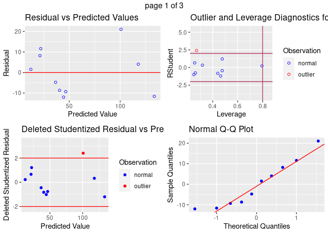
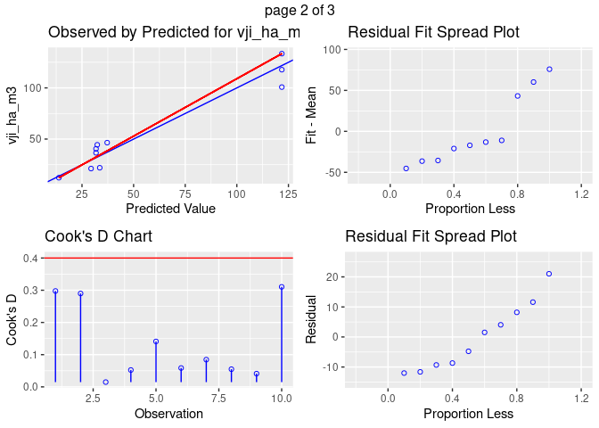
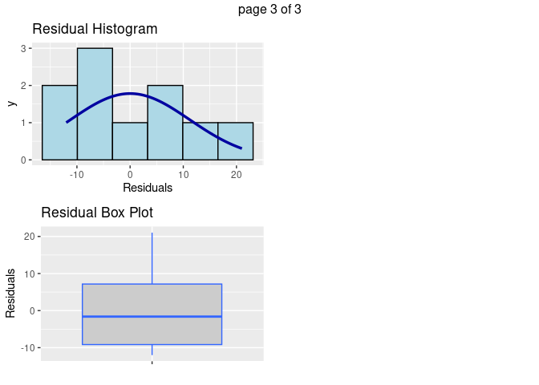
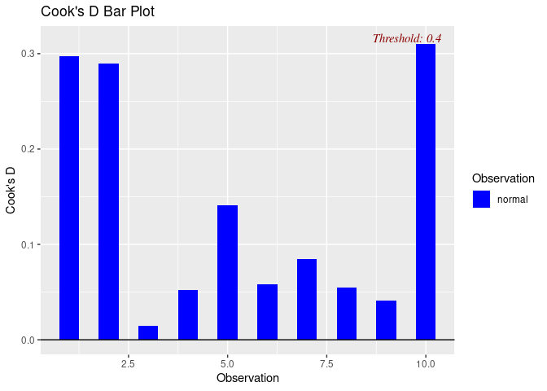

## Task 1 Prototype Tool for Quantifying GHG in Standing Timber Using VSC-Methodology-VM0010

The following workflow was used to test a prototype tool for quantifying greenhouse gas (GHG) emissions reduction. The objective is to illustrate the process outlined in the VCS Methodology, specifically VM0010, with an emphasis on simplicity of tool design over burdensome complexity. The chosen subsection for digitalization is "8.1.1 Calculation of carbon stocks in commercial timber volumes". A condensed script including only essential functions of this tool is reproduced in [Appendix I](#appendix1).

A number of empricial assumptions were made including sourcing of pre-existing inventory dataset with pre-defined format and values published in the exercise's document ('Program Officer Technology Solutions Seamus Murphy'). Using this table of observations, an excel spreadsheet was copied into and imported into an R environment as the dataframe '`dataset_raw'` and commited to the project's github repository [here](https://github.com/seamusrobertmurphy/verra-stage1-GHG-tool.git). In this original, unchanged dataset, assumptions of values can be viewed regarding sample strata, plot, species, tree, volume, species wood characteristics, and plot area.

The following table presents a data dictionary of these values, along with descriptions of their units, variable labels, types and file structure. Documentation of the dataset as it was received in original format '`dataset_raw.xlsx`' and descriptions of output dataset '`dataset_tidy.xlsx'` are intended to enable reproducability, encourage collaboration and inform future procedures for data submissions from clients.

+---------------------------------------------+---------------------------------+----------------------------------------------------------------------------------------------------+--------------------------+----------------------+
| #### ~**Label** (original =\> transformed)~ | #### ~**File location**~        | #### ~**Variable description**~                                                                    | #### ~**Units, values**~ | #### ~**Type**~      |
+---------------------------------------------+---------------------------------+----------------------------------------------------------------------------------------------------+--------------------------+----------------------+
| ~"Volume.V.l.j.I.sp"=\> "volume"~           | ~'dataset_raw', 'dataset_tidy'~ | ~Whole stem volume of living tree~                                                                 | ~m3~                     | ~numeric~            |
+---------------------------------------------+---------------------------------+----------------------------------------------------------------------------------------------------+--------------------------+----------------------+
| ~"Species..j." =\> "species_j"~             | ~'dataset_raw', 'dataset_tidy'~ | ~Tree species used at the species summary level.~                                                  | ~Sp1--Sp5~               | ~character~          |
+---------------------------------------------+---------------------------------+----------------------------------------------------------------------------------------------------+--------------------------+----------------------+
| ~"Stratum\...i." =\> 'stratum_i"~           | ~'dataset_raw', 'dataset_tidy'~ | ~Free form text field identifying stratum of each plot.~                                           | ~1, 2~                   | ~integer \> Factor~  |
+---------------------------------------------+---------------------------------+----------------------------------------------------------------------------------------------------+--------------------------+----------------------+
| ~"Plot..sp." =\> "plot_sp"~                 | ~'dataset_raw', 'dataset_tidy'~ | ~Numerical identifier unique only within its stratum.~                                             | ~1, 2, 3~                | ~integer~            |
+---------------------------------------------+---------------------------------+----------------------------------------------------------------------------------------------------+--------------------------+----------------------+
| ~"Tree..l." =\> "tree_l"~                   | ~'dataset_raw', 'dataset_tidy'~ | ~Text field identifying tree observation unique only specific plot family of associated stratum.~  | ~t1 - t5~                | ~character\>numeric~ |
+---------------------------------------------+---------------------------------+----------------------------------------------------------------------------------------------------+--------------------------+----------------------+
| ~"bcef_r"~                                  | ~'dataset_raw', 'dataset_tidy'~ | ~Biomass conversion and expansion factor used to derive carbon stocks from timber volume~          | ~%~                      | ~numeric~            |
+---------------------------------------------+---------------------------------+----------------------------------------------------------------------------------------------------+--------------------------+----------------------+
| ~"cf"~                                      | ~'dataset_raw', 'dataset_tidy'~ | ~Carbon factor used to derive carbon stocks from volumes of extracted  timber~                     | ~%~                      | ~numeric~            |
+---------------------------------------------+---------------------------------+----------------------------------------------------------------------------------------------------+--------------------------+----------------------+
| ~"d"~                                       | ~'dataset_tidy',~               | ~Basic wood density represented as fraction of dry in tons to green volume~                        | ~%~                      | ~numeric~            |
+---------------------------------------------+---------------------------------+----------------------------------------------------------------------------------------------------+--------------------------+----------------------+
| ~"a_sp"~                                    | ~dataset_tidy~                  | ~Area in hectares of individual sample plots~                                                      | ~ha~                     | ~numeric~            |
+---------------------------------------------+---------------------------------+----------------------------------------------------------------------------------------------------+--------------------------+----------------------+
| ~"vji_sp_m3"~                               | ~dataset_tidy~                  | ~Sum volume of merchantable timber of a species from specific plots within specific stratum~       | ~m3~                     | ~numeric~            |
+---------------------------------------------+---------------------------------+----------------------------------------------------------------------------------------------------+--------------------------+----------------------+
| ~"vji_ha_m3"~                               | ~dataset_tidy~                  | ~Mean volume per hectare of merchantable timber of a species in a specific stratum.~               | ~m3.ha-1~                | ~numeric~            |
+---------------------------------------------+---------------------------------+----------------------------------------------------------------------------------------------------+--------------------------+----------------------+
| ~chb_ha_tC~                                 | ~dataset_tidy~                  | ~Mean volume of carbon in extracted timber of species in stratum using 'bcef_r' and 'cf' factors.~ | ~tC.ha-1~                | ~numeric~            |
+---------------------------------------------+---------------------------------+----------------------------------------------------------------------------------------------------+--------------------------+----------------------+
| ~cex_ha_tC~                                 | ~dataset_tidy~                  | ~Mean volume of carbon in extracted biomass of a species in a stratum using 'd' and 'cf' factors.~ | ~tC.ha-1~                | ~numeric~            |
+---------------------------------------------+---------------------------------+----------------------------------------------------------------------------------------------------+--------------------------+----------------------+

## 1.1 Import Data

Import `dataset_raw` and write copy to `dataset_tidy`. Seed is set to `77777`.


```r
set.seed(77777)
dataset_raw = read_excel("dataset_raw.xlsx")
write.csv(dataset_raw, "dataset_tidy.csv", row.names = FALSE)
dataset_tidy = read.csv("dataset_tidy.csv")
dataset_tidy
```

```
# A tibble: 10 × 5
   Stratum...i. Plot..sp. Species..j. Tree..l. Volume..V_.l.j.I.sp..
          <int>     <int> <chr>       <chr>                    <dbl>
 1            1         1 Sp1         t1                        3.3 
 2            1         1 Sp1         t2                        4.8 
 3            1         1 Sp1         t3                        4.08
 4            1         2 Sp4         t1                        1.5 
 5            1         2 Sp4         t2                        1.68
 6            2         1 Sp1         t1                        1.38
 7            2         1 Sp2         t2                        3.24
 8            2         1 Sp3         t3                        3.72
 9            2         1 sp4         t4                        2.94
10            2         1 Sp5         t5                        3.36
```

## 1.2 Audit Data

Examine structure, scan for errors, and save `dataMaid` audit report for later use in drafting codebook and instruction list ([Appendix I](#appendix1)).


```r
str(dataset_tidy)
```

```
'data.frame':	10 obs. of  5 variables:
 $ Stratum...i.         : int  1 1 1 1 1 2 2 2 2 2
 $ Plot..sp.            : int  1 1 1 2 2 1 1 1 1 1
 $ Species..j.          : chr  "Sp1" "Sp1" "Sp1" "Sp4" ...
 $ Tree..l.             : chr  "t1" "t2" "t3" "t1" ...
 $ Volume..V_.l.j.I.sp..: num  3.3 4.8 4.08 1.5 1.68 1.38 3.24 3.72 2.94 3.36
```

```r
dplyr::count(dataset_tidy, Species..j.)
```

```
# A tibble: 6 × 2
  Species..j.     n
  <chr>       <int>
1 Sp1             4
2 Sp2             1
3 Sp3             1
4 Sp4             2
5 Sp5             1
6 sp4             1
```

```r
saveHTML(dataMaid::makeDataReport(
  dataset_tidy,
  output = "html",
  codebook = TRUE,
  onlyProblematic = TRUE,
  visuals = setVisuals(all = "basicVisual"),
  img.name = "dataset_audit",
  htmlfile = "dataset_audit",
  replace = TRUE
  
))
```


```
'data.frame':	10 obs. of  5 variables:
 $ Stratum...i.         : int  1 1 1 1 1 2 2 2 2 2
 $ Plot..sp.            : int  1 1 1 2 2 1 1 1 1 1
 $ Species..j.          : chr  "Sp1" "Sp1" "Sp1" "Sp4" ...
 $ Tree..l.             : chr  "t1" "t2" "t3" "t1" ...
 $ Volume..V_.l.j.I.sp..: num  3.3 4.8 4.08 1.5 1.68 1.38 3.24 3.72 2.94 3.36
```

```
# A tibble: 6 × 2
  Species..j.     n
  <chr>       <int>
1 Sp1             4
2 Sp2             1
3 Sp3             1
4 Sp4             2
5 Sp5             1
6 sp4             1
```

## 1.3 Tidy Data

Tests identified one problematic entry in values of `Species..j.` variable and multiple naming issues inherited during data import. Variable relabelling ws carried out according to naming convention stated in exercise document, the symbology used in subsection equations 1-4 of 8.1.1 of the [VM0010 Verra Methodology](https://verra.org/wp-content/uploads/2018/03/VM0010-Methodology-for-IMF-LtPF-v1.3_0.pdf), and syntax standards provided in the [Tidyverse style guide](https://style.tidyverse.org/). This involved the following changes.

-   Correct the case-sensitive error from `sp4` to `Sp4`.
-   Convert or recode variables to reflec their class
-   Remove spaces
-   Use underscores between words
-   Change to lowercase
-   Warnings, messages turned to silent
-   Space placed after commas
-   Max 80 characters to chunks
-   Comments limited to single line each
-   `::` operator used to signpost installs & avoid package conflicts


```r
data.table::setnames(dataset_tidy, old = "Stratum...i.", new = "stratum_i", skip_absent = TRUE)
data.table::setnames(dataset_tidy, old = "Species..j.", new = "species_j", skip_absent = TRUE)
data.table::setnames(dataset_tidy, old = "Plot..sp.", new = "plot_sp", skip_absent = TRUE)
data.table::setnames(dataset_tidy, old = "Tree..l.", new = "tree_l", skip_absent = TRUE)
data.table::setnames(dataset_tidy, old = "Volume..V_.l.j.I.sp..", new = "volume", skip_absent = TRUE)
dataset_tidy$species_j[dataset_tidy$species_j == "sp4"] <- "Sp4"
dataset_tidy$species_j = as.factor(dataset_tidy$species_j)
dataset_tidy$stratum_i <- as.factor(dataset_tidy$stratum_i)
```

<br>

Derive new variable columns using values provided in the exercise document. Compute additional variables of area estimates at different units and scales:

-   `bcef_r`: Biomass expansion factor applicable to wood removals (t.d.m m^-3^).
-   `cf`: Carbon fraction of biomass of species (tCt d.m.^-1^)
-   `d`: Basic wood density of species (t d.m. m^-3^)
-   `a_sp`: Total area of plot in hectares (ha)
-   `a_sp_m2`: Total area of plot in metres squared (m^2^)
-   `a_I_m2`: Total area of stratum in metres squared (m^2^)
-   `a_I_ha`: Total area of stratum in hectares (ha)

Tabulate, confirm and write to directory.


```r
dataset_tidy$bcef_r <- 0.7
dataset_tidy$cf <- 0.5
dataset_tidy$d <- 0.5
dataset_tidy$a_sp <- 0.1
dataset_tidy$a_sp_m2 <- dataset_tidy$a_sp * 10000

dataset_tidy = dataset_tidy %>%
  group_by(stratum_i) %>%
  mutate(a_I_m2 = sum(a_sp_m2), a_I_ha = sum(a_sp))

dataset_tidy %>% 
  select(stratum_i, species_j, plot_sp, tree_l, volume) %>% 
  tbl_summary(
    by = species_j,
    statistic = list(all_continuous() ~ "{mean} ({sd})",
                     all_categorical() ~ "{n} / {N} ({p}%)"),
    digits = all_continuous() ~ 1,
    type = all_categorical() ~ "categorical",
    label = list(stratum_i ~ "Strata",
                 species_j ~ "Species", 
                 plot_sp ~ "Plot ID#", 
                 tree_l ~ "Tree ID#", 
                 volume ~ "Biomass Volume (m3)"), 
              missing_text ="Missing"
              )
```

preserve6dcecf7402460f7e

```r
write.csv(dataset_tidy, "dataset_tidy.csv", row.names = FALSE)
```

<br>

## 2.1 Compute Biomass at Plot Level (Eq1)

Note all four equations that follow derive estimates according to specific species, whether measured at the plot level, stratum or globally. Hence, caution is advised when computing initial, absolute estimates and when deriving or applying hectare expansion factors.

On page 19 of the VM0010 Methodology, 'equation 1' provides calculation of merchantable timber volume of a species at the plot level. This is estimated in m^3^ as follows:

<br>

|                                                      $V_{j,i|BSL} = \sum_{l = 1}^{L} V_{l,j,i,sp}$

<br>

where $V_{j,i|BSL}$ refers to the [***sum***]{.underline} of merchantable volume of species *j* from plot *sp* in stratum *i.* For this, we run the following:


```r
dataset_tidy <- dataset_tidy %>%
  group_by(species_j, stratum_i, plot_sp) %>%
  mutate(vji_sp_m3 = sum(volume))

data.table::setDT(dataset_tidy)[, .(
  vji_sp_m3 = sum(volume)
),
by = .(stratum_i, plot_sp, species_j)
]
```

```
# A tibble: 7 × 4
  stratum_i plot_sp species_j vji_sp_m3
  <fct>       <int> <fct>         <dbl>
1 1               1 Sp1           12.2 
2 1               2 Sp4            3.18
3 2               1 Sp1            1.38
4 2               1 Sp2            3.24
5 2               1 Sp3            3.72
6 2               1 Sp4            2.94
7 2               1 Sp5            3.36
```

<br>

## 2.2 Compute Biomass at Strata Level (Eq2)

On page 19 of the VM0010 Methodology, 'equation 2' provides calculation of merchantable timber volume of a species at the stratum level:

<br>

|                                                  $V_{j,i|BSL} = \displaystyle \frac{1}{SP} \sum_{sp=1}^{sp} \displaystyle \frac{V_{j,i,sp}}{A_{sp}}$

<br>

where $V_{j,i|BSL}$ refers to the [***mean***]{.underline} merchantable timber volume of species *j* measured across all plots within stratum *i*. Volume estimates are derived in terms of m^3^/ha^-1^ using an expansion factor derived as the ratio of plot area 1,000m^2^ to 10,000m^2^, as follows.


```r
dataset_tidy <- dataset_tidy %>%
  group_by(stratum_i, species_j) %>%
  mutate(vji_ha_m3 = mean(vji_sp_m3) * 10)

data.table::setDT(dataset_tidy)[, .(
  vji_sp_m3,
  vji_ha_m3 = mean(vji_sp_m3) * 10
),
by = .(stratum_i, species_j)
]
```

```
# A tibble: 10 × 4
   stratum_i species_j vji_sp_m3 vji_ha_m3
   <fct>     <fct>         <dbl>     <dbl>
 1 1         Sp1           12.2      122. 
 2 1         Sp1           12.2      122. 
 3 1         Sp1           12.2      122. 
 4 1         Sp4            3.18      31.8
 5 1         Sp4            3.18      31.8
 6 2         Sp1            1.38      13.8
 7 2         Sp2            3.24      32.4
 8 2         Sp3            3.72      37.2
 9 2         Sp4            2.94      29.4
10 2         Sp5            3.36      33.6
```

<br>

## 2.3 Compute Carbon in Harvested Volumes (Eq3)

On page 20 of the VM0010 Methodology, 'equation 3' provides calculation of carbon stock of harvested timber volumes for species *i* in stratum *i*.

In the absence of harvest plan data, carbon stocks of commercial timber will be derived from the full inventory `dataset_tidy`.

This differs to 'equation 3' below, which measures mean carbon stock from volumes of 'harvested biomass' $C_{HB,j,i|BSL}$ comprised of volumes estimates from extracted timber that is destined off-site for market sales, in addition to volume estimates from extracted timber that is remaining on-site due to damage or use during site operations and road construction. The difference in destinations of these carbon stocks means that alternative carbon factors must be applied in their calculation, as indicated in following two equations

<br>

|                             $C_{HB,j,i|BSL} = (V_{EX,j,i|BSL} + V_{EX,INF,j,i|BSL} ) * BCEF_{R} * CF_{j}$

<br>

Carbon estimates are calculated in units of metric tons per hectare (tC/ha^-1^) by multiplying mean volume per hectare of extracted timber of species *i* from stratum *j* by the carbon fraction $CF$ and biomass conversion and expansion factor $BCEF_{R}$ of that species.


```r
dataset_tidy <- dataset_tidy %>%
  mutate(chb_ha_tC = vji_ha_m3 * bcef_r * cf)

data.table::setDT(dataset_tidy)[, .(
  vji_sp_m3,
  vji_ha_m3,
  chb_ha_tC = vji_ha_m3 * bcef_r * cf),
  by = .(stratum_i, species_j)
]
```

```
# A tibble: 10 × 5
   stratum_i species_j vji_sp_m3 vji_ha_m3 chb_ha_tC
   <fct>     <fct>         <dbl>     <dbl>     <dbl>
 1 1         Sp1           12.2      122.      42.6 
 2 1         Sp1           12.2      122.      42.6 
 3 1         Sp1           12.2      122.      42.6 
 4 1         Sp4            3.18      31.8     11.1 
 5 1         Sp4            3.18      31.8     11.1 
 6 2         Sp1            1.38      13.8      4.83
 7 2         Sp2            3.24      32.4     11.3 
 8 2         Sp3            3.72      37.2     13.0 
 9 2         Sp4            2.94      29.4     10.3 
10 2         Sp5            3.36      33.6     11.8 
```

<br>

## 2.4 Compute Carbon in Extracted Volumes (Eq4)

On page 21 of the VM0010 Methodology, 'equation 4' provides calculation of mean estimates of carbon stocks of species *i* in stratum *j,* by multiplying the species' value of basic wood density $D$ by its carbon fraction $CF$ by its mean volume of extracted biomass per hectare. Estimates of carbon stocks are derived in terms of metric tons per hectare tC.ha^-1^ using the following formula:

<br>

|                                   $C_{EX,j,i|BSL} = (V_{EX,j,i|BSL} + V_{EX,INF,j,i|BSL} ) * D_{j} * CF_{j}$

<br>


```r
dataset_tidy <- dataset_tidy %>%
  mutate(cex_ha_tC = vji_ha_m3 * d * cf)

data.table::setDT(dataset_tidy)[, .(
  vji_sp_m3, 
  vji_ha_m3, 
  chb_ha_tC,
  cex_ha_tC = vji_ha_m3 * d * cf),
  by = .(stratum_i, species_j)
]
```

```
# A tibble: 10 × 6
   stratum_i species_j vji_sp_m3 vji_ha_m3 chb_ha_tC cex_ha_tC
   <fct>     <fct>         <dbl>     <dbl>     <dbl>     <dbl>
 1 1         Sp1           12.2      122.      42.6      30.4 
 2 1         Sp1           12.2      122.      42.6      30.4 
 3 1         Sp1           12.2      122.      42.6      30.4 
 4 1         Sp4            3.18      31.8     11.1       7.95
 5 1         Sp4            3.18      31.8     11.1       7.95
 6 2         Sp1            1.38      13.8      4.83      3.45
 7 2         Sp2            3.24      32.4     11.3       8.1 
 8 2         Sp3            3.72      37.2     13.0       9.3 
 9 2         Sp4            2.94      29.4     10.3       7.35
10 2         Sp5            3.36      33.6     11.8       8.4 
```

## 3.1 Additional Metrics


```r
# vJ_ha_m3: Mean volume by species across strata (m^3.ha-1)
dataset_tidy <- dataset_tidy %>%
  group_by(species_j) %>%
  mutate(vJ_ha_m3 = mean(vji_sp_m3) * 10) 
dataset_tidy[1:10,] %>%
  select(stratum_i, species_j, 
         plot_sp, vji_ha_m3, 
         chb_ha_tC, cex_ha_tC, 
         vJ_ha_m3) %>%
  kbl(caption = "Table with right-hand showing mean biomass volume per species across all strata (m3.ha-1)", escape = T) %>%
  kable_minimal(full_width=T)
```

<table class=" lightable-minimal" style='font-family: "Trebuchet MS", verdana, sans-serif; margin-left: auto; margin-right: auto;'>
<caption>Table with right-hand showing mean biomass volume per species across all strata (m3.ha-1)</caption>
 <thead>
  <tr>
   <th style="text-align:left;"> stratum_i </th>
   <th style="text-align:left;"> species_j </th>
   <th style="text-align:right;"> plot_sp </th>
   <th style="text-align:right;"> vji_ha_m3 </th>
   <th style="text-align:right;"> chb_ha_tC </th>
   <th style="text-align:right;"> cex_ha_tC </th>
   <th style="text-align:right;"> vJ_ha_m3 </th>
  </tr>
 </thead>
<tbody>
  <tr>
   <td style="text-align:left;"> 1 </td>
   <td style="text-align:left;"> Sp1 </td>
   <td style="text-align:right;"> 1 </td>
   <td style="text-align:right;"> 121.8 </td>
   <td style="text-align:right;"> 42.63 </td>
   <td style="text-align:right;"> 30.45 </td>
   <td style="text-align:right;"> 94.8 </td>
  </tr>
  <tr>
   <td style="text-align:left;"> 1 </td>
   <td style="text-align:left;"> Sp1 </td>
   <td style="text-align:right;"> 1 </td>
   <td style="text-align:right;"> 121.8 </td>
   <td style="text-align:right;"> 42.63 </td>
   <td style="text-align:right;"> 30.45 </td>
   <td style="text-align:right;"> 94.8 </td>
  </tr>
  <tr>
   <td style="text-align:left;"> 1 </td>
   <td style="text-align:left;"> Sp1 </td>
   <td style="text-align:right;"> 1 </td>
   <td style="text-align:right;"> 121.8 </td>
   <td style="text-align:right;"> 42.63 </td>
   <td style="text-align:right;"> 30.45 </td>
   <td style="text-align:right;"> 94.8 </td>
  </tr>
  <tr>
   <td style="text-align:left;"> 1 </td>
   <td style="text-align:left;"> Sp4 </td>
   <td style="text-align:right;"> 2 </td>
   <td style="text-align:right;"> 31.8 </td>
   <td style="text-align:right;"> 11.13 </td>
   <td style="text-align:right;"> 7.95 </td>
   <td style="text-align:right;"> 31.0 </td>
  </tr>
  <tr>
   <td style="text-align:left;"> 1 </td>
   <td style="text-align:left;"> Sp4 </td>
   <td style="text-align:right;"> 2 </td>
   <td style="text-align:right;"> 31.8 </td>
   <td style="text-align:right;"> 11.13 </td>
   <td style="text-align:right;"> 7.95 </td>
   <td style="text-align:right;"> 31.0 </td>
  </tr>
  <tr>
   <td style="text-align:left;"> 2 </td>
   <td style="text-align:left;"> Sp1 </td>
   <td style="text-align:right;"> 1 </td>
   <td style="text-align:right;"> 13.8 </td>
   <td style="text-align:right;"> 4.83 </td>
   <td style="text-align:right;"> 3.45 </td>
   <td style="text-align:right;"> 94.8 </td>
  </tr>
  <tr>
   <td style="text-align:left;"> 2 </td>
   <td style="text-align:left;"> Sp2 </td>
   <td style="text-align:right;"> 1 </td>
   <td style="text-align:right;"> 32.4 </td>
   <td style="text-align:right;"> 11.34 </td>
   <td style="text-align:right;"> 8.10 </td>
   <td style="text-align:right;"> 32.4 </td>
  </tr>
  <tr>
   <td style="text-align:left;"> 2 </td>
   <td style="text-align:left;"> Sp3 </td>
   <td style="text-align:right;"> 1 </td>
   <td style="text-align:right;"> 37.2 </td>
   <td style="text-align:right;"> 13.02 </td>
   <td style="text-align:right;"> 9.30 </td>
   <td style="text-align:right;"> 37.2 </td>
  </tr>
  <tr>
   <td style="text-align:left;"> 2 </td>
   <td style="text-align:left;"> Sp4 </td>
   <td style="text-align:right;"> 1 </td>
   <td style="text-align:right;"> 29.4 </td>
   <td style="text-align:right;"> 10.29 </td>
   <td style="text-align:right;"> 7.35 </td>
   <td style="text-align:right;"> 31.0 </td>
  </tr>
  <tr>
   <td style="text-align:left;"> 2 </td>
   <td style="text-align:left;"> Sp5 </td>
   <td style="text-align:right;"> 1 </td>
   <td style="text-align:right;"> 33.6 </td>
   <td style="text-align:right;"> 11.76 </td>
   <td style="text-align:right;"> 8.40 </td>
   <td style="text-align:right;"> 33.6 </td>
  </tr>
</tbody>
</table>

```r
# VI_ha_m3: Mean volume by strata across species and plots (m^3.ha-1) 
dataset_tidy <- dataset_tidy %>%
  group_by(stratum_i) %>%
  mutate(vI_ha_m3 = mean(vji_sp_m3) * 10)
dataset_tidy[1:10,] %>%
  select(stratum_i, species_j, 
         plot_sp, vji_ha_m3, 
         chb_ha_tC, cex_ha_tC, 
         vJ_ha_m3, vI_ha_m3) %>%
  kbl(caption = "Table with right-hand column showing mean biomass volume per strata across all species and plots (m3.ha-1)", escape = T) %>%
  kable_minimal(full_width=T)
```

<table class=" lightable-minimal" style='font-family: "Trebuchet MS", verdana, sans-serif; margin-left: auto; margin-right: auto;'>
<caption>Table with right-hand column showing mean biomass volume per strata across all species and plots (m3.ha-1)</caption>
 <thead>
  <tr>
   <th style="text-align:left;"> stratum_i </th>
   <th style="text-align:left;"> species_j </th>
   <th style="text-align:right;"> plot_sp </th>
   <th style="text-align:right;"> vji_ha_m3 </th>
   <th style="text-align:right;"> chb_ha_tC </th>
   <th style="text-align:right;"> cex_ha_tC </th>
   <th style="text-align:right;"> vJ_ha_m3 </th>
   <th style="text-align:right;"> vI_ha_m3 </th>
  </tr>
 </thead>
<tbody>
  <tr>
   <td style="text-align:left;"> 1 </td>
   <td style="text-align:left;"> Sp1 </td>
   <td style="text-align:right;"> 1 </td>
   <td style="text-align:right;"> 121.8 </td>
   <td style="text-align:right;"> 42.63 </td>
   <td style="text-align:right;"> 30.45 </td>
   <td style="text-align:right;"> 94.8 </td>
   <td style="text-align:right;"> 85.80 </td>
  </tr>
  <tr>
   <td style="text-align:left;"> 1 </td>
   <td style="text-align:left;"> Sp1 </td>
   <td style="text-align:right;"> 1 </td>
   <td style="text-align:right;"> 121.8 </td>
   <td style="text-align:right;"> 42.63 </td>
   <td style="text-align:right;"> 30.45 </td>
   <td style="text-align:right;"> 94.8 </td>
   <td style="text-align:right;"> 85.80 </td>
  </tr>
  <tr>
   <td style="text-align:left;"> 1 </td>
   <td style="text-align:left;"> Sp1 </td>
   <td style="text-align:right;"> 1 </td>
   <td style="text-align:right;"> 121.8 </td>
   <td style="text-align:right;"> 42.63 </td>
   <td style="text-align:right;"> 30.45 </td>
   <td style="text-align:right;"> 94.8 </td>
   <td style="text-align:right;"> 85.80 </td>
  </tr>
  <tr>
   <td style="text-align:left;"> 1 </td>
   <td style="text-align:left;"> Sp4 </td>
   <td style="text-align:right;"> 2 </td>
   <td style="text-align:right;"> 31.8 </td>
   <td style="text-align:right;"> 11.13 </td>
   <td style="text-align:right;"> 7.95 </td>
   <td style="text-align:right;"> 31.0 </td>
   <td style="text-align:right;"> 85.80 </td>
  </tr>
  <tr>
   <td style="text-align:left;"> 1 </td>
   <td style="text-align:left;"> Sp4 </td>
   <td style="text-align:right;"> 2 </td>
   <td style="text-align:right;"> 31.8 </td>
   <td style="text-align:right;"> 11.13 </td>
   <td style="text-align:right;"> 7.95 </td>
   <td style="text-align:right;"> 31.0 </td>
   <td style="text-align:right;"> 85.80 </td>
  </tr>
  <tr>
   <td style="text-align:left;"> 2 </td>
   <td style="text-align:left;"> Sp1 </td>
   <td style="text-align:right;"> 1 </td>
   <td style="text-align:right;"> 13.8 </td>
   <td style="text-align:right;"> 4.83 </td>
   <td style="text-align:right;"> 3.45 </td>
   <td style="text-align:right;"> 94.8 </td>
   <td style="text-align:right;"> 29.28 </td>
  </tr>
  <tr>
   <td style="text-align:left;"> 2 </td>
   <td style="text-align:left;"> Sp2 </td>
   <td style="text-align:right;"> 1 </td>
   <td style="text-align:right;"> 32.4 </td>
   <td style="text-align:right;"> 11.34 </td>
   <td style="text-align:right;"> 8.10 </td>
   <td style="text-align:right;"> 32.4 </td>
   <td style="text-align:right;"> 29.28 </td>
  </tr>
  <tr>
   <td style="text-align:left;"> 2 </td>
   <td style="text-align:left;"> Sp3 </td>
   <td style="text-align:right;"> 1 </td>
   <td style="text-align:right;"> 37.2 </td>
   <td style="text-align:right;"> 13.02 </td>
   <td style="text-align:right;"> 9.30 </td>
   <td style="text-align:right;"> 37.2 </td>
   <td style="text-align:right;"> 29.28 </td>
  </tr>
  <tr>
   <td style="text-align:left;"> 2 </td>
   <td style="text-align:left;"> Sp4 </td>
   <td style="text-align:right;"> 1 </td>
   <td style="text-align:right;"> 29.4 </td>
   <td style="text-align:right;"> 10.29 </td>
   <td style="text-align:right;"> 7.35 </td>
   <td style="text-align:right;"> 31.0 </td>
   <td style="text-align:right;"> 29.28 </td>
  </tr>
  <tr>
   <td style="text-align:left;"> 2 </td>
   <td style="text-align:left;"> Sp5 </td>
   <td style="text-align:right;"> 1 </td>
   <td style="text-align:right;"> 33.6 </td>
   <td style="text-align:right;"> 11.76 </td>
   <td style="text-align:right;"> 8.40 </td>
   <td style="text-align:right;"> 33.6 </td>
   <td style="text-align:right;"> 29.28 </td>
  </tr>
</tbody>
</table>

```r
# Vsp_ha_n3: Total volume per plot (m^3.ha-1)
dataset_tidy = dataset_tidy %>%
  group_by(plot_sp, stratum_i) %>%
  mutate(Vsp_ha_m3 = sum(volume) * 10)
dataset_tidy[1:10,] %>%
  select(stratum_i, 
         plot_sp, vji_ha_m3, 
         chb_ha_tC, cex_ha_tC, 
         vJ_ha_m3, vI_ha_m3,
         vI_ha_m3, Vsp_ha_m3) %>%
  kbl(caption = "Table with right-hand column showing total biomass per plot across species (m3.ha-1)", escape = T) %>%
  kable_minimal(full_width=T)
```

<table class=" lightable-minimal" style='font-family: "Trebuchet MS", verdana, sans-serif; margin-left: auto; margin-right: auto;'>
<caption>Table with right-hand column showing total biomass per plot across species (m3.ha-1)</caption>
 <thead>
  <tr>
   <th style="text-align:left;"> stratum_i </th>
   <th style="text-align:right;"> plot_sp </th>
   <th style="text-align:right;"> vji_ha_m3 </th>
   <th style="text-align:right;"> chb_ha_tC </th>
   <th style="text-align:right;"> cex_ha_tC </th>
   <th style="text-align:right;"> vJ_ha_m3 </th>
   <th style="text-align:right;"> vI_ha_m3 </th>
   <th style="text-align:right;"> Vsp_ha_m3 </th>
  </tr>
 </thead>
<tbody>
  <tr>
   <td style="text-align:left;"> 1 </td>
   <td style="text-align:right;"> 1 </td>
   <td style="text-align:right;"> 121.8 </td>
   <td style="text-align:right;"> 42.63 </td>
   <td style="text-align:right;"> 30.45 </td>
   <td style="text-align:right;"> 94.8 </td>
   <td style="text-align:right;"> 85.80 </td>
   <td style="text-align:right;"> 121.8 </td>
  </tr>
  <tr>
   <td style="text-align:left;"> 1 </td>
   <td style="text-align:right;"> 1 </td>
   <td style="text-align:right;"> 121.8 </td>
   <td style="text-align:right;"> 42.63 </td>
   <td style="text-align:right;"> 30.45 </td>
   <td style="text-align:right;"> 94.8 </td>
   <td style="text-align:right;"> 85.80 </td>
   <td style="text-align:right;"> 121.8 </td>
  </tr>
  <tr>
   <td style="text-align:left;"> 1 </td>
   <td style="text-align:right;"> 1 </td>
   <td style="text-align:right;"> 121.8 </td>
   <td style="text-align:right;"> 42.63 </td>
   <td style="text-align:right;"> 30.45 </td>
   <td style="text-align:right;"> 94.8 </td>
   <td style="text-align:right;"> 85.80 </td>
   <td style="text-align:right;"> 121.8 </td>
  </tr>
  <tr>
   <td style="text-align:left;"> 1 </td>
   <td style="text-align:right;"> 2 </td>
   <td style="text-align:right;"> 31.8 </td>
   <td style="text-align:right;"> 11.13 </td>
   <td style="text-align:right;"> 7.95 </td>
   <td style="text-align:right;"> 31.0 </td>
   <td style="text-align:right;"> 85.80 </td>
   <td style="text-align:right;"> 31.8 </td>
  </tr>
  <tr>
   <td style="text-align:left;"> 1 </td>
   <td style="text-align:right;"> 2 </td>
   <td style="text-align:right;"> 31.8 </td>
   <td style="text-align:right;"> 11.13 </td>
   <td style="text-align:right;"> 7.95 </td>
   <td style="text-align:right;"> 31.0 </td>
   <td style="text-align:right;"> 85.80 </td>
   <td style="text-align:right;"> 31.8 </td>
  </tr>
  <tr>
   <td style="text-align:left;"> 2 </td>
   <td style="text-align:right;"> 1 </td>
   <td style="text-align:right;"> 13.8 </td>
   <td style="text-align:right;"> 4.83 </td>
   <td style="text-align:right;"> 3.45 </td>
   <td style="text-align:right;"> 94.8 </td>
   <td style="text-align:right;"> 29.28 </td>
   <td style="text-align:right;"> 146.4 </td>
  </tr>
  <tr>
   <td style="text-align:left;"> 2 </td>
   <td style="text-align:right;"> 1 </td>
   <td style="text-align:right;"> 32.4 </td>
   <td style="text-align:right;"> 11.34 </td>
   <td style="text-align:right;"> 8.10 </td>
   <td style="text-align:right;"> 32.4 </td>
   <td style="text-align:right;"> 29.28 </td>
   <td style="text-align:right;"> 146.4 </td>
  </tr>
  <tr>
   <td style="text-align:left;"> 2 </td>
   <td style="text-align:right;"> 1 </td>
   <td style="text-align:right;"> 37.2 </td>
   <td style="text-align:right;"> 13.02 </td>
   <td style="text-align:right;"> 9.30 </td>
   <td style="text-align:right;"> 37.2 </td>
   <td style="text-align:right;"> 29.28 </td>
   <td style="text-align:right;"> 146.4 </td>
  </tr>
  <tr>
   <td style="text-align:left;"> 2 </td>
   <td style="text-align:right;"> 1 </td>
   <td style="text-align:right;"> 29.4 </td>
   <td style="text-align:right;"> 10.29 </td>
   <td style="text-align:right;"> 7.35 </td>
   <td style="text-align:right;"> 31.0 </td>
   <td style="text-align:right;"> 29.28 </td>
   <td style="text-align:right;"> 146.4 </td>
  </tr>
  <tr>
   <td style="text-align:left;"> 2 </td>
   <td style="text-align:right;"> 1 </td>
   <td style="text-align:right;"> 33.6 </td>
   <td style="text-align:right;"> 11.76 </td>
   <td style="text-align:right;"> 8.40 </td>
   <td style="text-align:right;"> 33.6 </td>
   <td style="text-align:right;"> 29.28 </td>
   <td style="text-align:right;"> 146.4 </td>
  </tr>
</tbody>
</table>

```r
# Save output dataset
write.csv(dataset_tidy, "dataset_tidy.csv", row.names = FALSE)
```

## 3.2 Regression Diagnostics

For demonstration purposes only, an ordinary-least-squared (OLS) model was fitted with unscreened covariates from the above dataset and deployed to generate predictions of total standing timber over a site area of 100 hectares. From these predictions, derived residuals were acquired to showcase a number of diagnostic tools and accuracy metrics relevant to forest inventory analyses. This was a specifically diagnostic exercise not suited to informing or adjusting biomass estimates above. Instead this short test-run reported on techniques used in cross validation and tuning functions, encouraging discussion of model comparison and selections by potential clients.

Variables were recoded as numerics or integers to fit functions below. Additional set of packages were loaded at this stage as listed in the `requirements` variable below.


```r
requirements = install.packages(c(
  "oslrr", "ggplot2", "autoplotly", "BiocManager", "ggbio",
  "car", "psych", "useful", "caret",
  "BIOMASS", "rvest", "lmfor", "DescTools",
  "MLmetrics", "knitr", "phyloseq", "carData"), 
  dependencies=TRUE)
requirements
```


```r
#str(dataset_tidy)
dataset_tidy$stratum_i = as.integer(dataset_tidy$stratum_i)
dataset_tidy$species_j = as.integer(dataset_tidy$species_j)
model_lm1 <- lm(vji_ha_m3 ~ volume + species_j + stratum_i, data = dataset_tidy)
olsrr::ols_regress(vji_ha_m3 ~ volume + species_j + stratum_i, data = dataset_tidy)
```

```
                         Model Summary                          
---------------------------------------------------------------
R                       0.968       RMSE                13.706 
R-Squared               0.938       Coef. Var           23.820 
Adj. R-Squared          0.906       MSE                187.853 
Pred R-Squared          0.848       MAE                  9.281 
---------------------------------------------------------------
 RMSE: Root Mean Square Error 
 MSE: Mean Square Error 
 MAE: Mean Absolute Error 

                               ANOVA                                 
--------------------------------------------------------------------
                 Sum of                                             
                Squares       DF    Mean Square      F         Sig. 
--------------------------------------------------------------------
Regression    16909.928        3       5636.643    30.006     5e-04 
Residual       1127.116        6        187.853                     
Total         18037.044        9                                    
--------------------------------------------------------------------

                                    Parameter Estimates                                     
-------------------------------------------------------------------------------------------
      model       Beta    Std. Error    Std. Beta      t        Sig       lower      upper 
-------------------------------------------------------------------------------------------
(Intercept)     84.003        20.840                  4.031    0.007     33.008    134.997 
     volume     21.765         4.239        0.557     5.135    0.002     11.393     32.138 
  species_j     -8.343         3.189       -0.294    -2.616    0.040    -16.145     -0.540 
  stratum_i    -46.712         8.999       -0.550    -5.191    0.002    -68.731    -24.692 
-------------------------------------------------------------------------------------------
```

```r
#psych::describe(dataset_tidy$vji_ha_m3)
#psych::describe(dataset_tidy$volume)
#psych::describe(dataset_tidy$species_j)
#psych::describe(dataset_tidy$stratum_i)

shapiro.test(dataset_tidy$volume)
```

```

	Shapiro-Wilk normality test

data:  dataset_tidy$volume
W = 0.9223, p-value = 0.3766
```

```r
shapiro.test(dataset_tidy$vji_ha_m3)
```

```

	Shapiro-Wilk normality test

data:  dataset_tidy$vji_ha_m3
W = 0.69994, p-value = 0.0008795
```

|              |          |        |        |              |
|--------------|----------|--------|--------|--------------|
| **Variable** | **Mean** | **SD** | **SE** | **Skewness** |
| stratum_i    | 1.5      | 0.53   | 0.17   | 0.00         |
| species_j    | 2.60     | 1.58   | 0.50   | 0.14         |
| volume       | 3.00     | 1.15   | 0.36   | 0.36         |
| vji_ha_m3    | 57.54    | 44.77  | 14.16  | 0.69         |


```
-----------------------------------------------
       Test             Statistic       pvalue  
-----------------------------------------------
Shapiro-Wilk              0.918          0.3407 
Kolmogorov-Smirnov        0.1812         0.8419 
Cramer-von Mises          0.8333         0.0048 
Anderson-Darling          0.3383         0.4225 
-----------------------------------------------
```

```

 Breusch Pagan Test for Heteroskedasticity
 -----------------------------------------
 Ho: the variance is constant            
 Ha: the variance is not constant        

                Data                  
 -------------------------------------
 Response : vji_ha_m3 
 Variables: fitted values of vji_ha_m3 

        Test Summary         
 ----------------------------
 DF            =    1 
 Chi2          =    0.7880034 
 Prob > Chi2   =    0.3747045 
```

```
Tolerance and Variance Inflation Factor
---------------------------------------
  Variables Tolerance      VIF
1    volume 0.8842968 1.130842
2 species_j 0.8247492 1.212490
3 stratum_i 0.9278966 1.077706


Eigenvalue and Condition Index
------------------------------
  Eigenvalue Condition Index    intercept     volume  species_j    stratum_i
1 3.63391993        1.000000 3.184201e-03 0.00687952 0.01296957 6.623171e-03
2 0.25093610        3.805451 4.067109e-03 0.14908146 0.50064841 8.506720e-06
3 0.08426133        6.567098 2.275283e-05 0.26599152 0.32764056 7.126742e-01
4 0.03088264       10.847521 9.927259e-01 0.57804751 0.15874147 2.806942e-01
```

```
# A tibble: 1 × 3
  studentized_residual unadjusted_p_val bonferroni_p_val
                 <dbl>            <dbl>            <dbl>
1                 2.41           0.0609            0.609
```

```
# A tibble: 3 × 3
  Variables Tolerance   VIF
  <chr>         <dbl> <dbl>
1 volume        0.884  1.13
2 species_j     0.825  1.21
3 stratum_i     0.928  1.08
```



+-------+-------+-------+-------+-------+-------+--------------------------------+
|       |       | Model | SW    | BP    | BF    | stratum_i_VIF \| species_j_VIF |
+-------+-------+-------+-------+-------+-------+--------------------------------+
| M1    | 0.918 | 0.375 | 0.609 | 1.078 | 1.212 | 1.131                          |
+-------+-------+-------+-------+-------+-------+--------------------------------+
| M2    |       |       |       |       |       |                                |
+-------+-------+-------+-------+-------+-------+--------------------------------+
| M3    |       |       |       |       |       |                                |
+-------+-------+-------+-------+-------+-------+--------------------------------+

## Appendix I: Codebook Derived {#appendix1}


```r
htmltools::includeHTML("dataMaid_dataset_tidy.html")
```

preserve3e7be5de24f5c98a


```r
library(gvlma)
gvmodel = gvlma(model_lm1)
summary(gvmodel)
```

```

Call:
lm(formula = vji_ha_m3 ~ volume + species_j + stratum_i, data = dataset_tidy)

Residuals:
    Min      1Q  Median      3Q     Max 
-12.013  -9.160  -1.621   7.163  21.026 

Coefficients:
            Estimate Std. Error t value Pr(>|t|)   
(Intercept)   84.003     20.840   4.031  0.00687 **
volume        21.765      4.239   5.135  0.00215 **
species_j     -8.343      3.189  -2.616  0.03979 * 
stratum_i    -46.712      8.999  -5.191  0.00203 **
---
Signif. codes:  0 '***' 0.001 '**' 0.01 '*' 0.05 '.' 0.1 ' ' 1

Residual standard error: 13.71 on 6 degrees of freedom
Multiple R-squared:  0.9375,	Adjusted R-squared:  0.9063 
F-statistic: 30.01 on 3 and 6 DF,  p-value: 0.0005211


ASSESSMENT OF THE LINEAR MODEL ASSUMPTIONS
USING THE GLOBAL TEST ON 4 DEGREES-OF-FREEDOM:
Level of Significance =  0.05 

Call:
 gvlma(x = model_lm1) 

                     Value p-value                Decision
Global Stat        1.67301  0.7956 Assumptions acceptable.
Skewness           0.50756  0.4762 Assumptions acceptable.
Kurtosis           0.31191  0.5765 Assumptions acceptable.
Link Function      0.04837  0.8259 Assumptions acceptable.
Heteroscedasticity 0.80517  0.3696 Assumptions acceptable.
```

```r
gvmodel_del <- deletion.gvlma(gvmodel)
summary(gvmodel_del)
```

```

Global test deletion statistics.

Linear Model:
 lm(formula = vji_ha_m3 ~ volume + species_j + stratum_i, data = dataset_tidy) 

gvlma call:
 gvlma(x = model_lm1) 


Summary values:
                        Min.     1st Qu.      Median         Mean     3rd Qu.
DeltaGlobalStat  -9.72694635   0.7823003  29.6693499   35.5614771  37.6760517
GStatpvalue       0.44504963   0.6801663   0.7046418    0.6909652   0.7932309
DeltaStat1      -98.28474779 -58.3179473 -37.7557766  -11.7320234  52.6971301
Stat1pvalue       0.31529615   0.3805261   0.5772874    0.5669468   0.6456254
DeltaStat2      -67.71643904 -47.4278101 -19.7704833   14.7720196  51.4359292
Stat2pvalue       0.36830595   0.4919745   0.6169664    0.5790533   0.6855997
DeltaStat3      -90.13847523 -15.4776611  98.6017603 1236.4135466 511.1005330
Stat3pvalue       0.09192598   0.5880043   0.7576559    0.6459577   0.8397684
DeltaStat4      -98.70890629 -56.0322595  19.8499773    1.2899558  59.5376240
Stat4pvalue       0.21056287   0.2577431   0.3264671    0.4437903   0.5535005
                        Max.
DeltaGlobalStat  122.4251595
GStatpvalue        0.8248189
DeltaStat1        98.6668094
Stat1pvalue        0.9256606
DeltaStat2       159.4866019
Stat2pvalue        0.7509953
DeltaStat3      5772.2599342
Stat3pvalue        0.9449385
DeltaStat4        94.6861208
Stat4pvalue        0.9187898


Unusual observations for Global Stat:
[1] Delta Global Stat (%)  Global Stat p-value 
<0 rows> (or 0-length row.names)


Unusual observations for Directional Stat1:
[1] Delta Directional Stat1 (%)  Directional Stat1 p-value 
<0 rows> (or 0-length row.names)


Unusual observations for Directional Stat2:
[1] Delta Directional Stat2 (%)  Directional Stat2 p-value 
<0 rows> (or 0-length row.names)


Unusual observations for Directional Stat3:
  Delta Directional Stat3 (%)  Directional Stat3 p-value
1                    5772.260                 0.09192598
2                    5674.666                 0.09467011


Unusual observations for Directional Stat4:
[1] Delta Directional Stat4 (%)  Directional Stat4 p-value 
<0 rows> (or 0-length row.names)
```

```r
plot(gvmodel_del)
```

<!-- --><!-- --><!-- --><!-- --><!-- --><!-- --><!-- --><!-- --><!-- --><!-- --><!-- --><!-- --><!-- --><!-- --><!-- -->

```r
display.delstats
```

```
function (deletedStatvals, deletedpvals, nsd = 3, TukeyStyle = TRUE, 
    statname = "G", pointlabels) 
{
    n <- length(deletedStatvals)
    if (length(deletedpvals) != n) 
        stop("deleted test statistic values must be same length as p values")
    if (missing(pointlabels)) 
        pointlabels <- as.character(1:n)
    grange <- range(deletedStatvals)
    prange <- range(deletedpvals)
    glim <- max(abs(grange)) * c(-1, 1) * 1.1
    plim <- max(abs(prange)) * c(0, 1) * 1.1
    if (missing(statname)) {
        argname <- deparse(substitute(deletedStatvals))
        if (length(grep("G", argname)) > 0) 
            statname <- "G"
        else if (length(grep("1", argname)) > 0) 
            statname <- "S1"
        else if (length(grep("2", argname)) > 0) 
            statname <- "S2"
        else if (length(grep("3", argname)) > 0) 
            statname <- "S3"
        else if (length(grep("4", argname)) > 0) 
            statname <- "S4"
        else statname <- "xx"
    }
    xlabnm = switch(statname, G = expression(paste("Deleted ", 
        {
            G[4]
        }^2, " statistic (% change)")), S1 = expression(paste("Deleted ", 
        {
            S[1]
        }^2, " statistic (% change)")), S2 = expression(paste("Deleted ", 
        {
            S[2]
        }^2, " statistic (% change)")), S3 = expression(paste("Deleted ", 
        {
            S[3]
        }^2, " statistic (% change)")), S4 = expression(paste("Deleted ", 
        {
            S[4]
        }^2, " statistic (% change)")), xx = paste("Deleted statistics"))
    plot(glim, plim, type = "n", xlab = xlabnm, ylab = expression(paste("Deleted p value")), 
        main = "Outlying and Influential Observtions")
    points(deletedStatvals, deletedpvals, pch = 1)
    meanG <- mean(deletedStatvals)
    sdG <- sqrt(var(deletedStatvals))
    meanp <- mean(deletedpvals)
    sdp <- sqrt(var(deletedpvals))
    if (TukeyStyle) {
        quantsG <- quantile(deletedStatvals, probs = c(0.25, 
            0.5, 0.75))
        iqrG <- quantsG[3] - quantsG[1]
        lfG <- quantsG[1] - nsd * iqrG
        ufG <- quantsG[3] + nsd * iqrG
        quantsp <- quantile(deletedpvals, probs = c(0.25, 0.5, 
            0.75))
        iqrp <- quantsp[3] - quantsp[1]
        lfp <- quantsp[1] - nsd * iqrp
        ufp <- quantsp[3] + nsd * iqrp
    }
    else {
        ufG <- meanG + nsd * sdG
        lfG <- meanG - nsd * sdG
        ufp <- meanp + nsd * sdp
        lfp <- meanp - nsd * sdp
    }
    lfp <- max(lfp, 0)
    ufp <- min(ufp, 1)
    flagG <- ifelse((deletedStatvals > ufG) | (deletedStatvals < 
        lfG), TRUE, FALSE)
    flagp <- ifelse((deletedpvals > ufp) | (deletedpvals < lfp), 
        TRUE, FALSE)
    flag <- flagG | flagp
    if (any(flag)) {
        points(deletedStatvals[flag], deletedpvals[flag], pch = 4, 
            col = 2, lwd = 2)
        text(deletedStatvals[flag], deletedpvals[flag], labels = pointlabels[flag], 
            pos = 3, offset = 0.25)
    }
    abline(v = ufG, lty = 2, lwd = 0.5)
    abline(v = lfG, lty = 2, lwd = 0.5)
    abline(h = ufp, lty = 2, lwd = 0.5)
    abline(h = lfp, lty = 2, lwd = 0.5)
    z <- data.frame(deletedStatvals, deletedpvals)[flag, ]
    rownames(z) <- pointlabels[flag]
    invisible(z)
}
<bytecode: 0x5579152d7290>
<environment: namespace:gvlma>
```

```r
summary.gvlmaDel 
```

```
function (object, allstats = TRUE, ...) 
{
    gvlmaDelobj <- object
    nobs <- nrow(gvlmaDelobj)
    oddcols <- seq(1, ncol(gvlmaDelobj), by = 2)
    Stats <- gvlmaDelobj[, oddcols]
    nstats <- ncol(Stats)
    pvals <- gvlmaDelobj[, -oddcols]
    AllQs <- lapply(as.list(gvlmaDelobj), summary)
    StatQs <- lapply(as.list(Stats), summary)
    pvalQs <- lapply(as.list(pvals), summary)
    AllQsMat <- matrix(unlist(AllQs), nrow = ncol(gvlmaDelobj), 
        byrow = TRUE)
    StatQsMat <- matrix(unlist(StatQs), nrow = length(oddcols), 
        byrow = TRUE)
    pvalQsMat <- matrix(unlist(pvalQs), nrow = length(oddcols), 
        byrow = TRUE)
    rownames(AllQsMat) <- names(gvlmaDelobj)
    rownames(StatQsMat) <- names(StatQs)
    rownames(pvalQsMat) <- names(pvalQs)
    colnames(AllQsMat) <- names(AllQs[[1]])
    colnames(StatQsMat) <- names(StatQs[[1]])
    colnames(pvalQsMat) <- names(pvalQs[[1]])
    upperfencestat <- StatQsMat[, 5] + 3 * (StatQsMat[, 5] - 
        StatQsMat[, 2])
    lowerfencestat <- StatQsMat[, 2] - 3 * (StatQsMat[, 5] - 
        StatQsMat[, 2])
    upperfencepval <- pvalQsMat[, 5] + 3 * (pvalQsMat[, 5] - 
        pvalQsMat[, 2])
    lowerfencepval <- pvalQsMat[, 2] - 3 * (pvalQsMat[, 5] - 
        pvalQsMat[, 2])
    hiStats <- Stats > matrix(upperfencestat, nrow = nobs, ncol = nstats, 
        byrow = TRUE)
    loStats <- Stats < matrix(lowerfencestat, nrow = nobs, ncol = nstats, 
        byrow = TRUE)
    hipvals <- pvals > matrix(upperfencepval, nrow = nobs, ncol = nstats, 
        byrow = TRUE)
    lopvals <- pvals < matrix(lowerfencepval, nrow = nobs, ncol = nstats, 
        byrow = TRUE)
    unusualStats <- hiStats | loStats
    unusualpvals <- hipvals | lopvals
    unusualobs <- unusualStats | unusualpvals
    cat("\nGlobal test deletion statistics.\n")
    cat("\nLinear Model:\n", deparse(attr(gvlmaDelobj, "lmcall")), 
        "\n")
    cat("\ngvlma call:\n", deparse(attr(gvlmaDelobj, "gvlmacall")), 
        "\n")
    cat("\n\nSummary values:\n")
    print(AllQsMat)
    if (allstats) 
        statloop <- c("Global Stat", "Directional Stat1", "Directional Stat2", 
            "Directional Stat3", "Directional Stat4")
    else statloop <- "Global Stat"
    statindx <- 0
    for (nm in statloop) {
        statindx <- statindx + 1
        unusualobsStat <- unusualobs[, statindx]
        unusualindx <- which(unusualobsStat)
        unusualobsprint <- data.frame(Stats[unusualindx, statindx], 
            pvals[unusualindx, statindx], row.names = unusualindx)
        names(unusualobsprint) <- paste(c("Delta", ""), nm, c("(%)", 
            "p-value"), sep = " ")
        cat("\n\nUnusual observations for ", nm, ":\n", sep = "")
        print(unusualobsprint)
    }
    invisible(as.data.frame(unusualobs))
}
<bytecode: 0x557914b7ef18>
<environment: namespace:gvlma>
```

```r
summary(gvmodel_del, allstats = FALSE)
```

```

Global test deletion statistics.

Linear Model:
 lm(formula = vji_ha_m3 ~ volume + species_j + stratum_i, data = dataset_tidy) 

gvlma call:
 gvlma(x = model_lm1) 


Summary values:
                        Min.     1st Qu.      Median         Mean     3rd Qu.
DeltaGlobalStat  -9.72694635   0.7823003  29.6693499   35.5614771  37.6760517
GStatpvalue       0.44504963   0.6801663   0.7046418    0.6909652   0.7932309
DeltaStat1      -98.28474779 -58.3179473 -37.7557766  -11.7320234  52.6971301
Stat1pvalue       0.31529615   0.3805261   0.5772874    0.5669468   0.6456254
DeltaStat2      -67.71643904 -47.4278101 -19.7704833   14.7720196  51.4359292
Stat2pvalue       0.36830595   0.4919745   0.6169664    0.5790533   0.6855997
DeltaStat3      -90.13847523 -15.4776611  98.6017603 1236.4135466 511.1005330
Stat3pvalue       0.09192598   0.5880043   0.7576559    0.6459577   0.8397684
DeltaStat4      -98.70890629 -56.0322595  19.8499773    1.2899558  59.5376240
Stat4pvalue       0.21056287   0.2577431   0.3264671    0.4437903   0.5535005
                        Max.
DeltaGlobalStat  122.4251595
GStatpvalue        0.8248189
DeltaStat1        98.6668094
Stat1pvalue        0.9256606
DeltaStat2       159.4866019
Stat2pvalue        0.7509953
DeltaStat3      5772.2599342
Stat3pvalue        0.9449385
DeltaStat4        94.6861208
Stat4pvalue        0.9187898


Unusual observations for Global Stat:
[1] Delta Global Stat (%)  Global Stat p-value 
<0 rows> (or 0-length row.names)
```

# Task 2 Prototype Tool for Mapping Wildfires Using the NASA-FIRMS and Earth-Engine API's

The digital tool for Task 2 was derived on the Google Colab platform using python programming, a jupyter notebook and the Google Earth Engine library. Using the following link, the tool can be viewed there in its hosted environment with its interactive maps pre-loaded.

The Colab platform should also ensure simpler installation when sharing externally, downloading locally, or running copies in different a Colab project. Note that full editor settings were enabled with this link allowing for code edits to be made by user.

Task 1 Output File Name & Webpage: `verra_task1.ipynb`

-   <https://colab.research.google.com/drive/11izi_5-iYHOCWHwj17vWxWtlMPbglBiG?usp=sharing>

In addition, copies of the Colab notebook were committed to the project's github repository for easy cloning and revisions:

-   <https://github.com/seamusrobertmurphy/verra-tasks1-2/blob/main/verra_task2.ipynb>
